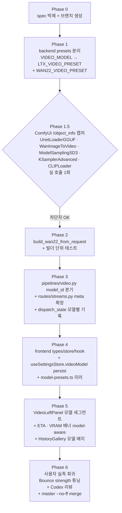

# Video 모델 선택 — Wan 2.2 i2v 추가 + LTX-2.3 듀얼 (Spec v2)

**작성일**: 2026-05-03
**상태**: 기획 v2 (사용자 v1 초안 → 코드베이스 실측 보강)
**작성자**: Opus 4.7 (사용자 공동 기획)
**대상 파일**: `docs/superpowers/specs/2026-05-03-video-model-selection-wan22.md` (V0 commit)
**참조 구현**: `docs/superpowers/specs/2026-04-24-video-ltx23-design.md` (LTX 단일 모드 spec)

---

## 0. v1 → v2 변경 요약 (핵심)

사용자 v1 초안을 코드베이스 실측과 대조해 **5건 정정 + 4건 단순화**:

| 항목 | v1 (초안) | v2 (정정) | 근거 |
|------|-----------|-----------|------|
| `PipelineMode` rename `"video"` → `"video-ltx"`/`"video-wan22"` | ✓ 제안 | ✗ **유지 안 함** | `mode === "video"` 가 frontend 10+ 곳에 박힘 (ProgressModal/PipelineTimeline/InfoPanel/VideoRightPanel.filter/types.ts/HistoryMode union…). 5단계 stage 구조가 두 모델 동일 → mode 분기 대신 **`videoModelId` discriminator** 만 통과시키면 됨 |
| history v6 → v7 schema migration (`model_id` 컬럼) | ✓ 제안 | ✗ **불필요** | 현재 `SCHEMA_VERSION=8` (v7=reference_ref/role · v8=reference_templates). 기존 `model TEXT` 컬럼이 이미 `"LTX Video 2.3"` 등 display name 저장. Wan 은 `"Wan 2.2 i2v"` 동일 컬럼 사용 → migration 0건. 향후 `model_id` 별 통계가 필요해지면 그때 **v8→v9** `_migrate_add_model_id` 신설 (try/except + ALTER TABLE ADD COLUMN + idempotent UPDATE backfill — 기존 v2~v8 패턴 미러) |
| `pytest 408 / vitest 150` | "현재 408" 박제 | **현재 408 / 165** | 사용자 박제 (parametrized 케이스 포함). v2 는 +8 / +3 증분만 |
| `class VideoRequest(BaseModel)` body 확장 | ✓ 제안 | ✗ **multipart meta JSON** | `routes/streams.py::create_video_task` 가 `image: UploadFile + meta: str = Form(...)` 패턴. `model_id` 는 meta 안 string 필드 |
| `studio/pipelines/_mock_stream.py` mock 분리 | ✓ 제안 | ✗ **frontend mock 만** | 백엔드는 mock 안 함 (실 ComfyUI mock 은 `comfy_transport` 의 `COMFY_MOCK_FALLBACK` 처리). frontend `lib/api/mocks/video.ts` 만 model_id 인지 |
| `dict[str, VideoModelPreset \| Wan22ModelPreset]` union dict | ✓ 제안 | ✗ **별 dataclass 유지** | 두 dataclass 가 구조 다름. `LTX_VIDEO_PRESET` (기존 rename) + `WAN22_VIDEO_PRESET` 각자, dispatch 는 `model_id: Literal["ltx","wan22"]` 분기 |
| 모델 선택 UI 위치 | `app/video/page.tsx` 안 | **`VideoLeftPanel.tsx` 상단** (StudioModeHeader 와 SourceImageCard 사이) | page.tsx 는 87줄 shell · 입력은 LeftPanel 책임 |
| 모델 선택 persistence | useVideoStore 만 | **`useSettingsStore.videoModel` 도 persist** (Generate/Edit 패턴 미러) + 페이지 진입 시 useVideoStore 가 settings 값으로 init | 일관성 + 사용자 마지막 선택 기억 |
| ComfyUI 노드 타입 검증 | "⚠️ 검증 필요" 인라인 경고만 | **Phase 1.5 hard blocker** (LTX V1.5 SaveVideo 캡처와 동일 패턴) | 실 구동 안 한 채 빌더 코드 작성하면 첫 E2E 에서 KeyError |

---

## 1. Context — 왜 이 변경이 필요한가

현재 영상 모드는 **LTX-2.3 단일 모델**(`backend/studio/presets.py::VIDEO_MODEL`) 로 박제. 16GB VRAM 환경에서 29GB fp8 unet 이 sysmem swap 으로 동작해 **5초 영상 약 25~40분** 소요 (Lightning OFF 기준).

사용자가 2026-05-03 ComfyUI Desktop 에서 **Wan 2.2 14B i2v Q6_K GGUF + LightX2V 4-step LoRA** 워크플로우 ([Next Diffusion 공식](https://cdn.nextdiffusion.ai/comfyui-workflows/wan2-2-I2V-GGUF-LightX2V.json)) 를 실증:

| 항목 | 결과 |
|------|------|
| 모델 | `Wan2.2-I2V-A14B-{HighNoise,LowNoise}-Q6_K.gguf` (각 11.18 GB) |
| Lightning LoRA | `wan2.2_i2v_lightx2v_4steps_lora_v1_{high,low}_noise.safetensors` |
| 해상도/프레임 | 832×480 / 81 frames (5초 @ 16fps) |
| 1세대 시간 | **약 320초** (5분대 · LTX 16GB swap 대비 5~8배 빠름) |
| VRAM 점유 | high → low **순차 swap** 으로 16GB 안에 fit (sysmem 의존 ↓) |
| 결과 품질 | 모션 자연스러움, 손가락 deformation 만 가벼운 약점 (Wan i2v 공통) |

**결론**: LTX 의 spatial upscaler (해상도 ↑) 는 unique 가치이므로 **폐기 X · 듀얼 구조**. 기본값은 사용자 결정 따라 **Wan 2.2** (속도/안정성 우수).

### 비목표 (YAGNI)

- t2v / Wan 2.2 fp8_scaled 옵션 / 추가 motion LoRA 슬롯 (Bounce 외) / RIFE 보간 / Wan 전용 spatial upscale
- GGUF custom node self-check (1인 환경 가정 — `UnetLoaderGGUF` 미설치 시 ComfyUI 가 직접 에러)

---

## 2. 사용자 확정 결정 사항 (2026-05-03)

| # | 항목 | 결정 |
|---|------|------|
| 1 | 기본 모델 | **Wan 2.2** (`videoModel="wan22"` Default · settings persist) |
| 2 | Lightning LoRA | **토글 default ON** (4-step). OFF 시 step 20 / cfg 3.5 / split 10 |
| 3 | Bounce LoRA | **항상 ON** (strength 0.8 · Phase 5 실측 후 0.6/0.7/0.8/0.9 비교 튜닝) |
| 4 | GGUF self-check | **없음** (1인 환경) |
| 5 | 해상도 한도 | **512~1536 / 8배수 스냅** (LTX 와 슬라이더 공유). Wan 권장 sweet spot 832×480 ~ 1024×576 은 도움말 텍스트 |
| 6 | History 모델 배지 | **표시** (기존 `model` 컬럼의 display name 으로) |
| 7 | DB schema | **변경 없음** (v8 유지 · `model` 컬럼 재활용) |

---

## 3. 아키텍처

### 3.1 변경 의존성 (Phase 순서) — Mermaid



### 3.2 데이터 흐름 — 한 컷

```
[VideoLeftPanel]                        [streams.py /video]
  ModelSegment ─┐                          parse meta
  Lightning ─┐  │                          ↓
  Source ────┼──┴──→ POST multipart  ──→ model_id Literal["ltx","wan22"]
  Prompt ────┘     {image, meta:JSON}     ↓
                                         pipelines/video._run_video_pipeline_task
                                          ├ if model_id=="ltx":
                                          │   build_ltx_from_request (기존)
                                          └ if model_id=="wan22":
                                              build_wan22_from_request (NEW)
                                                  ↓
                                              ComfyUI dispatch (공용)
                                                  ↓
                                              _save_comfy_video (공용 — 둘 다 mp4)
                                                  ↓
                                              history insert (mode="video", model=preset.display_name)
```

### 3.3 재사용 자산 (건드리지 않음)

- 백엔드: `_dispatch_to_comfy`, `_save_comfy_video`, `extract_output_files`, `force_unload_all_loaded_models`, `prompt_pipeline.upgrade_video_prompt` (Wan 도 같은 영문 cinematic 프롬프트 잘 받음 — 향후 차이 발견 시 별 spec)
- 프론트: `SourceImageCard`, `VideoPlayerCard`, `ProgressModal`, `PipelineTimeline`, `useVideoStore` 의 prompt/source/lightning 슬라이스
- DB: `studio_history.model` 컬럼 (display name 저장)

---

## 4. 백엔드 변경 — 파일별 상세

### 4.1 `backend/studio/presets.py` — preset 분리 + Wan22 추가

**현 상태**: `VIDEO_MODEL: VideoModelPreset` 단일.

**변경**:

```python
# (1) 기존 VIDEO_MODEL → LTX_VIDEO_PRESET 으로 rename + 호환 alias 유지
LTX_VIDEO_PRESET = VideoModelPreset(...)  # 기존 VIDEO_MODEL 본문 그대로
VIDEO_MODEL = LTX_VIDEO_PRESET  # 호환 alias — Phase 6 정리 후 제거

# (2) Wan 2.2 전용 dataclass (구조 다름 — 통합 X)
@dataclass(frozen=True)
class Wan22LoraEntry:
    name_high: str
    name_low: str
    strength: float
    role: Literal["lightning", "motion"]
    note: str = ""

@dataclass(frozen=True)
class Wan22Files:
    unet_high: str
    unet_low: str
    text_encoder: str  # umt5_xxl_fp8_e4m3fn_scaled.safetensors
    vae: str           # wan_2.1_vae.safetensors

@dataclass(frozen=True)
class Wan22Sampling:
    sampler: str = "euler"
    scheduler: str = "simple"
    shift: float = 8.0          # ModelSamplingSD3 — GGUF 권장
    base_fps: int = 16          # Wan 학습 fps
    default_length: int = 81    # 5초 @ 16fps + 1
    default_width: int = 832
    default_height: int = 480
    lightning_steps: int = 4
    lightning_cfg: float = 1.0
    lightning_split: int = 2    # high noise end_step
    precise_steps: int = 20
    precise_cfg: float = 3.5
    precise_split: int = 10

@dataclass(frozen=True)
class Wan22ModelPreset:
    display_name: str   # "Wan 2.2 i2v"
    tag: str            # "Q6_K · GGUF"
    files: Wan22Files
    loras: list[Wan22LoraEntry]
    sampling: Wan22Sampling
    negative_prompt: str

WAN22_VIDEO_PRESET = Wan22ModelPreset(
    display_name="Wan 2.2 i2v",
    tag="Q6_K · GGUF",
    files=Wan22Files(
        unet_high="Wan2.2-I2V-A14B-HighNoise-Q6_K.gguf",
        unet_low="Wan2.2-I2V-A14B-LowNoise-Q6_K.gguf",
        text_encoder="umt5_xxl_fp8_e4m3fn_scaled.safetensors",
        vae="wan_2.1_vae.safetensors",
    ),
    loras=[
        Wan22LoraEntry(
            name_high="wan2.2_i2v_lightx2v_4steps_lora_v1_high_noise.safetensors",
            name_low="wan2.2_i2v_lightx2v_4steps_lora_v1_low_noise.safetensors",
            strength=1.0, role="lightning",
            note="4-step 가속 (Lightning ON 시만)",
        ),
        Wan22LoraEntry(
            # 모션 LoRA 는 high/low noise 대상 분리 안 됨 (Lightning 처럼 분기 학습된 게 아님) →
            # 동일 파일을 high/low 두 노이즈 stage 의 LoraLoaderModelOnly 에 각각 주입.
            # Lightning LoRA (위) 와 패턴 통일을 위해 name_high/name_low 둘 다 채워두지만 실제 같은 파일.
            name_high="BounceHighWan2_2.safetensors",
            name_low="BounceHighWan2_2.safetensors",
            strength=0.8, role="motion",
            note="BounceHigh 모션 (항상 ON · Phase 5 실측 후 0.6/0.7/0.8/0.9 튜닝 · 동일 파일 high+low 양쪽 적용)",
        ),
    ],
    sampling=Wan22Sampling(),
    negative_prompt=(
        "deformed hands, mutated hands, extra fingers, missing fingers, fused fingers, "
        "malformed limbs, bad anatomy, distorted hands, twisted fingers, blurry hands, "
        "low quality, jpeg artifacts, watermark, text"
    ),
)

# (3) dispatch lookup — Literal type-safe
VideoModelId = Literal["ltx", "wan22"]
DEFAULT_VIDEO_MODEL_ID: VideoModelId = "wan22"

def get_video_preset(model_id: VideoModelId) -> VideoModelPreset | Wan22ModelPreset:
    if model_id == "ltx": return LTX_VIDEO_PRESET
    if model_id == "wan22": return WAN22_VIDEO_PRESET
    raise ValueError(f"unknown video model_id: {model_id}")
```

**기존 import sites 갱신** (실측 `grep VIDEO_MODEL` — production 13 ref / 5 파일 + 테스트 20+ ref):

- `studio/presets.py` (3 ref · 정의 + alias) — Phase 1 본거지
- `studio/comfy_api_builder/video.py` (6 ref) — Phase 2 에서 `_build_ltx` 로 캡슐화
- `studio/pipelines/video.py` (2 ref · L28 import / L237,L255 사용) — Phase 3 에서 model_id 분기
- `studio/routes/streams.py` (2 ref · L31 import / L361 dispatch_state) — Phase 3 에서 분기
- `tests/studio/test_video_builder.py` (20+ ref) — `LTX_VIDEO_PRESET` 로 명시 또는 alias 그대로 (Phase 1 에서 alias 유지하면 회귀 0)

### 4.2 `backend/studio/comfy_api_builder/video.py` — Wan22 빌더 추가

**현 facade**:
```python
def build_video_from_request(*, prompt, source_filename, seed, ...) -> ApiPrompt:
    # 기존 LTX 빌더 단일
```

**변경 후**:
```python
def build_video_from_request(
    *,
    model_id: VideoModelId = DEFAULT_VIDEO_MODEL_ID,
    prompt: str,
    source_filename: str,
    seed: int,
    negative_prompt: str | None = None,
    adult: bool = False,        # LTX 만 의미 있음 (Wan 무시)
    source_width: int | None = None,
    source_height: int | None = None,
    longer_edge: int | None = None,
    lightning: bool = True,
    unet_override: str | None = None,  # LTX 만 (.env LTX_UNET_NAME)
) -> ApiPrompt:
    if model_id == "ltx":
        return _build_ltx(...)   # 기존 build_video_from_request 본문 → private
    if model_id == "wan22":
        return _build_wan22(...)
    raise ValueError(...)
```

`_build_wan22()` 노드 그래프 (Phase 1.5 검증 완료 · 2026-05-03):

```
─── 공통 (sampling 전 1회) ───
LoadImage(source_filename) → IMAGE
CLIPLoader(clip_name=files.text_encoder, type="wan", device="default") → CLIP
VAELoader(vae_name=files.vae) → VAE

CLIPTextEncode(text=prompt,           clip) → CONDITIONING raw_pos
CLIPTextEncode(text=negative_prompt,  clip) → CONDITIONING raw_neg

WanImageToVideo(
    positive=raw_pos, negative=raw_neg,
    vae,
    width=request.width, height=request.height, length=81, batch_size=1,
    start_image=LoadImage.IMAGE,           # optional (i2v 핵심 입력)
)  → outputs: (positive_v, negative_v, latent_init)
   # ⚠ 발견 (Phase 1.5): WanImageToVideo 는 CONDITIONING × 2 + LATENT 3개 출력.
   # raw cond 를 video-aware cond 로 변환 + i2v 초기 latent 동시 produce.
   # KSamplerAdvanced 의 positive/negative/latent_image 는 모두 이 출력에서 받음.

─── HIGH NOISE 분기 ───
UnetLoaderGGUF(unet_name=files.unet_high) → MODEL
   # ⚠ 발견 (Phase 1.5): required=unet_name 만. spec v2 의 dequant_dtype 파라미터는 노드에 없음 → 제거.
    ↓
[Lightning ON] LoraLoaderModelOnly(model, lora_name=lightning.name_high, strength_model=1.0)
    ↓
LoraLoaderModelOnly(model, lora_name=motion.name_high, strength_model=0.8)
    ↓
ModelSamplingSD3(model, shift=8.0) → model_high
    ↓
KSamplerAdvanced(
    model=model_high,
    add_noise="enable", noise_seed=seed,
    steps=4 (or 20), cfg=1.0 (or 3.5),
    sampler_name="euler", scheduler="simple",
    positive=positive_v,                   # WanImageToVideo 출력 (공유)
    negative=negative_v,                   # WanImageToVideo 출력 (공유)
    latent_image=latent_init,              # WanImageToVideo 출력
    start_at_step=0, end_at_step=2 (or 10),
    return_with_leftover_noise="enable",
)  → latent_high

─── LOW NOISE 분기 ───
UnetLoaderGGUF(unet_name=files.unet_low) → Lightning LOW(토글) → motion(0.8) → ModelSamplingSD3(8.0) → model_low
    ↓
KSamplerAdvanced(
    model=model_low,
    add_noise="disable", noise_seed=seed,  # high 와 동일 seed
    steps=4 (or 20), cfg=1.0 (or 3.5),
    sampler_name="euler", scheduler="simple",
    positive=positive_v,                   # 동일 cond 재사용 (이미 video-aware)
    negative=negative_v,
    latent_image=latent_high,              # high stage 출력 (leftover noise 포함)
    start_at_step=2 (or 10), end_at_step=10000,
    return_with_leftover_noise="disable",
)  → latent_final

─── 출력 ───
VAEDecode(samples=latent_final, vae) → IMAGE frames
CreateVideo(images=frames, fps=16) → VIDEO   # fps 는 FLOAT 아니라 spec 박제 정수도 OK (default 30 → 16 override)
SaveVideo(video, filename_prefix="video/AIS-Video", format="auto", codec="h264")

# ⚠ first-frame anchor 매핑: LTX 의 LTXVImgToVideoInplace.{first_strength,second_strength} (얼굴 drift 대응 widget) 에
# 정확히 1:1 대응되는 Wan 의 widget 은 **존재하지 않음** (WanImageToVideo 는 단일 노드 · strength widget X).
# Wan 의 first-frame anchor 강도는 high/low 분기의 noise schedule (KSamplerAdvanced split) 자체로 제어 →
# 손가락/얼굴 drift 가 심하면 Lightning OFF 로 split=10 (precise) 사용 권장. Phase 6 사용자 평가 후 재검토.
```

> **✅ Phase 1.5 검증 (2026-05-03)**: 12 node type 모두 ComfyUI 에 등록됨. INPUT_TYPES 정확 매핑 완료. 발견 2건 (`WanImageToVideo` 출력 = CONDITIONING × 2 + LATENT 3개 / `UnetLoaderGGUF.dequant_dtype` 미존재) 본 다이어그램에 반영. 캡처 파일: `docs/superpowers/specs/2026-05-03-wan22-object-info/object_info_wan22.json`.

### 4.3 `backend/studio/pipelines/video.py` — model_id 분기

```python
async def _run_video_pipeline_task(
    task: Task,
    image_bytes: bytes,
    prompt: str,
    filename: str,
    ollama_model_override: str | None = None,
    vision_model_override: str | None = None,
    adult: bool = False,
    source_width: int = 0,
    source_height: int = 0,
    longer_edge: int | None = None,
    lightning: bool = True,
    *,
    model_id: VideoModelId = DEFAULT_VIDEO_MODEL_ID,  # NEW
    pre_upgraded_prompt: str | None = None,
    prompt_mode: str = "fast",
) -> None:
    preset = get_video_preset(model_id)
    ...
    def _make_video_prompt(uploaded_name: str | None) -> dict[str, Any]:
        return build_video_from_request(
            model_id=model_id,                     # NEW
            prompt=video_res.final_prompt,
            source_filename=uploaded_name,
            seed=actual_seed,
            unet_override=unet_override if model_id == "ltx" else None,
            adult=adult, source_width=..., longer_edge=..., lightning=lightning,
        )
    ...
    # history item — fps/frameCount 모델별
    if model_id == "ltx":
        s = preset.sampling
        item.update(fps=s.fps, frameCount=s.frame_count, durationSec=s.seconds)
    else:  # wan22
        s = preset.sampling
        item.update(fps=s.base_fps, frameCount=s.default_length,
                    durationSec=round(s.default_length / s.base_fps, 2))
    item["model"] = preset.display_name  # "LTX Video 2.3" 또는 "Wan 2.2 i2v"
    item["modelId"] = model_id           # NEW — 프론트가 배지 색/라벨 분기용 (DB 저장은 model 컬럼만, 응답에만 동봉)
```

### 4.4 `backend/studio/routes/streams.py` — meta 파싱 확장

```python
# create_video_task 안
model_id_raw = meta_obj.get("modelId") or meta_obj.get("model_id")
model_id: VideoModelId = (
    "ltx" if isinstance(model_id_raw, str) and model_id_raw == "ltx" else "wan22"
)  # default Wan 22

preset = get_video_preset(model_id)
dispatch_state.record("video", preset.display_name)  # 기존 VIDEO_MODEL.display_name 대체

task.worker = _spawn(
    _run_video_pipeline_task(
        task, image_bytes, prompt, image.filename or "input.png",
        ollama_override, vision_override, adult, source_w, source_h,
        longer_edge, lightning,
        model_id=model_id,
        pre_upgraded_prompt=pre_upgraded_prompt,
        prompt_mode=video_prompt_mode,
    )
)
```

### 4.5 `backend/studio/history_db/*` — 변경 없음

기존 `model TEXT` 컬럼이 display name 그대로 받음. `modelId` 는 **API 응답에만** 동봉 (프론트 store/렌더용). DB persist 안 함 — 향후 통계가 필요해지면 그때 ADD COLUMN.

### 4.6 `backend/studio/router.py` (facade)

별도 변경 없음 — `from .routes import studio_router as router` 그대로. preset alias 유지로 외부 import 회귀 0.

---

## 5. 프론트엔드 변경 — 파일별 상세

### 5.1 `frontend/lib/model-presets.ts` — LTX 미러 + Wan22 미러 신규

> **주의**: 현재 `lib/model-presets.ts` 에는 `GENERATE_MODEL` / `EDIT_MODEL` 만 있고 **Video 미러는 없다**. 본 plan 에서 LTX 와 Wan 양쪽 미러를 동시에 신규 추가 (둘 다 신규).

```typescript
export type VideoModelId = "wan22" | "ltx";

export interface VideoModelPresetMirror {
  id: VideoModelId;
  displayName: string;
  tag: string;
  defaultWidth: number;
  defaultHeight: number;
  defaultLength: number;
  baseFps: number;
  lightning: { steps: number; cfg: number };
  precise: { steps: number; cfg: number };
  recommendedSweetSpot?: string;
  vramHint?: string;
  speedHint: { lightning: string; precise: string };
}

export const VIDEO_MODEL_PRESETS: Record<VideoModelId, VideoModelPresetMirror> = {
  wan22: {
    id: "wan22", displayName: "Wan 2.2 i2v", tag: "Q6_K · GGUF",
    defaultWidth: 832, defaultHeight: 480, defaultLength: 81, baseFps: 16,
    lightning: { steps: 4, cfg: 1.0 },
    precise:   { steps: 20, cfg: 3.5 },
    recommendedSweetSpot: "832×480 ~ 1024×576",
    vramHint: "high → low 순차 swap · 16GB 안에 fit",
    speedHint: { lightning: "약 5분", precise: "약 20분" },
  },
  ltx: {
    id: "ltx", displayName: "LTX Video 2.3", tag: "22B · A/V · upscale",
    defaultWidth: 1024, defaultHeight: 576, defaultLength: 126, baseFps: 25,
    lightning: { steps: 4, cfg: 1.0 },
    precise:   { steps: 30, cfg: 1.0 },
    recommendedSweetSpot: "1024×576 ~ 1536 long-edge",
    vramHint: "29GB fp8 · 16GB 환경은 sysmem swap (느림)",
    speedHint: { lightning: "5~10분", precise: "25~40분" },
  },
};

export const DEFAULT_VIDEO_MODEL_ID: VideoModelId = "wan22";
```

`backend/studio/presets.py` 변경 시 동기화 (CLAUDE.md 🟡 Important).

### 5.2 `frontend/stores/useSettingsStore.ts` — videoModel persist

```typescript
interface SettingsState {
  // 기존 generateModel / editModel / ollamaModel / visionModel
  videoModel: VideoModelId;  // NEW — default DEFAULT_VIDEO_MODEL_ID
  setVideoModel: (v: VideoModelId) => void;
}
```

`persist` middleware 가 자동으로 localStorage 저장. Generate/Edit 패턴 미러.

### 5.3 `frontend/stores/useVideoStore.ts` — selectedVideoModel + 모델 전환 정책

```typescript
interface VideoState {
  // 기존 ...
  selectedVideoModel: VideoModelId;
  setSelectedVideoModel: (id: VideoModelId) => void;
}

// 페이지 마운트 시 1회 init: useSettingsStore.getState().videoModel 로 sync
// (VideoLeftPanel useEffect — promptModeInitRef 패턴 동일)
```

`useVideoInputs` 그룹 selector 에 추가.

**모델 전환 시 width/height 정책 — 결정 (단일안)**:

`setSelectedVideoModel` 호출 시 **사용자가 슬라이더로 직접 조작한 적 있으면 longerEdge 유지, 아니면 새 모델의 sweet spot longer-edge 로 자동 채움**.

- 구현: `useVideoStore` 에 `longerEdgeUserOverride: boolean` (default false) 추가
- **set true 트리거**: 슬라이더 onChange (사용자 의도 변경)
- **reset false 트리거**: ① 페이지 진입 시 settings init, ② [📐 원본] 버튼 클릭 (도움 액션 — 모델 sweet spot 무시 의도 X), ③ 새 source image 업로드 (새 작업 컨텍스트)
- 모델 전환 시:
  - `longerEdgeUserOverride === false` → 새 모델 권장 사이즈 (`Wan: 832 longer-edge` / `LTX: 1536 longer-edge`) 자동 set
  - `longerEdgeUserOverride === true` → 현재 longerEdge 유지 (8배수 스냅 + range clamp 만)
- `compute_video_resize` 가 source 비율 유지하므로 width/height 는 항상 자동 계산. 사용자가 만지는 건 **longer-edge 단 1개**.

이 정책으로 사용자가 의도적으로 1024 로 맞췄다면 모델 바꿔도 1024 유지, 한 번도 안 만진 상태에선 새 모델 sweet spot 로 자동 정렬 — "sticky user choice" UX.

### 5.4 `frontend/lib/api/types.ts` + `frontend/lib/api/video.ts` — request 확장

> **`types.ts` 손편집만** — 백엔드는 `modelId` 를 dict 동봉으로만 보내고 Pydantic 응답 모델 X → OpenAPI schema 불변. `gen:types` 호출 **불필요** (generated.ts 자동 갱신 안 됨, 손편집 `types.ts` 가 단일 source).

```typescript
// types.ts
export interface VideoRequest {
  // 기존 ...
  modelId?: VideoModelId;  // NEW — 미전달 시 백엔드 default = "wan22"
}
export interface HistoryItem {
  // 기존 ...
  modelId?: VideoModelId;  // NEW — done 이벤트 응답에서 받음 (DB persist X · 세션만)
}

// video.ts realVideoStream multipart meta 안
meta: JSON.stringify({
  prompt: req.prompt, adult, lightning, longerEdge, ollamaModel, visionModel,
  preUpgradedPrompt, promptMode,
  modelId: req.modelId,  // NEW
})
```

### 5.5 `frontend/hooks/useVideoPipeline.ts` — model_id 전달

```typescript
const selectedVideoModel = useVideoStore((s) => s.selectedVideoModel);
// generate() 안 videoImageStream 호출에 modelId: selectedVideoModel 추가
```

### 5.6 `frontend/components/studio/video/VideoLeftPanel.tsx` — 모델 세그먼트 + ETA model-aware

위치: `<StudioModeHeader />` 와 `[원본 이미지]` 카드 사이.

```tsx
<VideoModelSegment
  value={selectedVideoModel}
  onChange={setSelectedVideoModel}   // 호출부 단순 — 한 곳에서 fan-out
  options={Object.values(VIDEO_MODEL_PRESETS)}
/>
```

**Source-of-truth 정책 (옵션 A 채택)**: `useVideoStore.setSelectedVideoModel(id)` 가 내부에서 `useSettingsStore.getState().setVideoModel(id)` 도 함께 호출 → 호출부는 한 곳, settings persist 자동. 두 zustand `set` 은 동기 호출이라 race 없음. (옵션 B "settings → useVideoStore 가 useEffect 로 follow" 는 effect chain 이 더 길어서 각하.)

세그먼트 컨트롤 자체는 `Toggle`/`Tabs` 와 비슷한 신규 작은 컴포넌트 (50줄 내외 · 디자인 토큰 활용).

CTA ETA 텍스트:
```tsx
const eta = lightning
  ? VIDEO_MODEL_PRESETS[selectedVideoModel].speedHint.lightning
  : VIDEO_MODEL_PRESETS[selectedVideoModel].speedHint.precise;
<div className="ais-cta-eta">평균 소요 <span className="mono">{eta}</span> · {duration}초 영상 · 로컬 처리</div>
```

VRAM 배너 (선택) — `vramHint` 표시.

### 5.7 `frontend/components/studio/HistoryGallery.tsx` (또는 HistoryTile) — 모델 배지

> **Badge 신규 컴포넌트 신설**: 현재 frontend `components/` 에 `Badge` 가 없음 (`find -iname "*Badge*"` → 0건). 본 plan 에서 `frontend/components/ui/Badge.tsx` 신설 (variant `violet`/`cyan`, 작은 chip 스타일 — `.ais-history-badge` CSS 토큰).

```tsx
{item.mode === "video" && item.model && (
  <Badge tone={item.modelId === "wan22" ? "violet" : "cyan"}>
    {item.model}
  </Badge>
)}
```

`item.modelId` 가 세션에만 존재 (DB 미저장). DB 옛 row 는 100% LTX (Wan 행은 본 spec 후에만 발생) → **`item.modelId` 누락이면 자동 cyan (LTX)**, 신규 row 는 `item.modelId` 우선.

### 5.8 PipelineMode 변경 없음

`mode="video"` 5단계 stage 정의 유지. 두 모델 stage label 동일:
1. vision-analyze
2. prompt-merge
3. workflow-dispatch
4. comfyui-sampling
5. save-output

(만약 사용자가 향후 "Wan 의 high/low sampling 을 별 row 로 보고 싶다" 요구 시 그때 PipelineMode 분기 — 본 spec 범위 외)

### 5.9 `frontend/lib/api/mocks/video.ts` — model_id passthrough

mock 응답의 `item.model` / `item.modelId` 가 요청한 modelId 따라 분기 ("Wan 2.2 i2v" / "LTX Video 2.3"). fps/frameCount 도 모델별 값.

---

## 6. Phase 1.5 — ComfyUI 노드 검증 (hard blocker)

LTX V1.5 SaveVideo 캡처와 동일 패턴. **이 단계 건너뛰면 Phase 2 빌더가 첫 E2E 에서 KeyError**.

### 절차

1. ComfyUI Desktop 실 구동 → `http://127.0.0.1:8000/object_info` GET 응답 다운로드
2. 다음 6개 class_type 의 input schema 확인 + spec §4.2 의 노드 그래프와 1:1 대조 (각 노드의 출처 패키지 박제):

| class_type | 출처 패키지 | 검증할 입력 |
|------------|-------------|-------------|
| `UnetLoaderGGUF` | **city96/ComfyUI-GGUF** custom node (category: `bootleg`) | `unet_name` (required only · `dequant_dtype` 미존재 · 2026-05-03 검증) |
| `WanImageToVideo` | **ComfyUI core** (Wan 지원 0.3+) | positive, negative, vae, start_image, width, height, length, batch_size — 출력 latent slot index |
| `ModelSamplingSD3` | **ComfyUI core** | `shift`, `model` |
| `KSamplerAdvanced` | **ComfyUI core** | `add_noise`, `noise_seed`, `steps`, `cfg`, `sampler_name`, `scheduler`, `start_at_step`, `end_at_step`, `return_with_leftover_noise`, `model`, `positive`, `negative`, `latent_image` |
| `CLIPLoader` | **ComfyUI core** | `type` enum 에 `"wan"` 포함 여부 |
| `LoraLoaderModelOnly` | **ComfyUI core** | `model`, `lora_name`, `strength_model` |

만약 `WanImageToVideo` 또는 `CLIPLoader type="wan"` 이 core 에 없으면 별도 Wan custom node 패키지 필요 — 그 경우 패키지명 박제 후 사용자에게 설치 안내.
3. 결과 JSON 발췌를 spec §13 (검증 결과) 에 첨부
4. 발견 차이는 빌더 코드에 즉시 반영 (Phase 2 코드 작성 전)

### 게이트 조건

- `_object_info_wan22.json` 파일이 `docs/superpowers/specs/2026-05-03-wan22-object-info/` 아래 박제
- 위 6개 type 의 필드명/슬롯 인덱스 모두 spec 과 일치 또는 spec 갱신 완료

---

## 7. 테스트 계획

### 7.1 Backend 단위 (pytest 408 → 약 416)

- `tests/studio/test_comfy_api_builder_wan22.py` (신규) — 6 케이스
  - 빌더 출력의 노드 수 + class_type 셋 검증
  - Lightning ON: KSamplerAdvanced 두 노드의 steps=4/cfg=1.0/end_step=2/10000 확인
  - Lightning OFF: steps=20/cfg=3.5/end_step=10/10000
  - LoRA 체인 순서: lightning → motion (high/low 각각)
  - ModelSamplingSD3.shift=8 고정
  - WanImageToVideo length=81/width=832/height=480 default
- `tests/studio/test_video_pipeline_wan22.py` (신규) — 2 케이스
  - `_run_video_pipeline_task(model_id="wan22")` SSE stage 시퀀스 (vision/upgrade/dispatch/sampling/save)
  - history item 의 fps=16, frameCount=81, model="Wan 2.2 i2v" 검증
- `tests/studio/test_video_builder.py` (수정) — 기존 LTX 테스트 보존 + `model_id="ltx"` 명시 추가만

### 7.2 Frontend 단위 (vitest 165 → 약 168)

- `__tests__/use-video-store-model-switch.test.ts` (신규) — `setSelectedVideoModel("wan22"→"ltx")` 가 width/height/length 자동 갱신 / Lightning 유지
- `__tests__/api-video-model-id.test.ts` (신규) — `videoImageStream` 의 multipart meta JSON 에 `modelId` 포함 확인

### 7.3 회귀

- pytest + vitest + tsc + lint **clean 유지**
- LTX 단일 모드 동작 100% 동일 (model_id 미지정 시 백엔드 default 가 wan22 라는 점만 주의 — 기존 e2e 테스트가 LTX 명시 안 했다면 wan22 로 가서 깨짐. 명시적 `modelId="ltx"` 박제 필요)

### 7.4 사용자 수동 통합 (Phase 6)

- Wan 2.2 (Lightning ON) · 832×480 · 81f → 약 5분 안에 완료 + 영상 재생 정상
- Wan 2.2 (Lightning OFF) · 832×480 → 약 20분
- LTX 2.3 (기존 회귀) · 1024×576 → 기존 동작 동일
- 모델 세그먼트 토글 → defaults 자동 채움 + ETA 텍스트 변화
- History 갤러리에 Wan/LTX 배지 색상 분리 표시
- Settings 재진입 시 마지막 선택 모델 유지 (persist 검증)

### 7.5 Bounce LoRA strength 튜닝 (Phase 6)

- 0.6 / 0.7 / 0.8 / 0.9 각 1세대 비교 → 모션 자연스러움 + 얼굴 안정 균형 결정
- 결과 spec §13 박제 + `WAN22_VIDEO_PRESET.loras[1].strength` 확정

---

## 8. Phase 분할 + 검증 게이트

| Phase | 범위 | Gate |
|-------|------|------|
| 0 | spec 박제 (`docs/superpowers/specs/2026-05-03-video-model-selection-wan22.md`) + branch `feature/video-wan22-model-selection` | spec PASS |
| 1 | `presets.py` 분리 (`LTX_VIDEO_PRESET` rename + alias + `WAN22_VIDEO_PRESET` + `get_video_preset`) + `lib/model-presets.ts` 미러 + `gen:types` | pytest 408 PASS · tsc clean |
| **1.5** | **ComfyUI `/object_info` 캡처 + spec §6 검증** | 차단자 OK 후 Phase 2 |
| 2 | `comfy_api_builder/video.py::_build_wan22` + 단위 테스트 6건 | pytest 408+6 PASS |
| 3 | `pipelines/video.py` model_id 분기 + `routes/streams.py` meta 파싱 + `dispatch_state` 모델별 + 통합 테스트 2건 | pytest 408+8 PASS |
| 4 | frontend types/store/hook 확장 + `useSettingsStore.videoModel` persist + mock model_id | vitest 165+3 PASS · tsc clean |
| 5 | `VideoLeftPanel` 세그먼트 + ETA/VRAM model-aware + `HistoryGallery` 배지 | UI 수동 회귀 PASS |
| 6 | 사용자 실측 회귀 + Bounce strength 튜닝 + Codex 리뷰 + master `--no-ff` merge | 실측 PASS + Codex OK |

각 Phase 별 commit (한국어 OK · type(scope) 관례). Phase 4 시리즈 학습 박제 적용:
- facade re-export 갱신은 각 phase 안에서
- patch site 즉시 갱신
- mock.patch 위치 = lookup 모듈 기준

---

## 9. 위험 / 트레이드오프 / 정책

| 위험 | 완화 |
|------|------|
| `UnetLoaderGGUF` 미설치 환경 | Phase 1.5 게이트로 사전 검출 (1인 환경 가정 — self-check 코드 X) |
| Wan 손가락 deformation | negative_prompt 강화 (이미 spec 반영). 사용자 시작 이미지 손 포즈 명확 권장 (UI 도움말 후보) |
| LTX 회귀 (기존 e2e 가 modelId 미지정 → wan22 로 흐름) | 기존 LTX 테스트에 `modelId="ltx"` 명시 추가 (Phase 3 안에서 수정) |
| Bounce 0.8 가 어울리지 않음 | Phase 6 튜닝 + spec §13 박제 |
| `model` 컬럼만으로 통계 부족 | 향후 "model_id 별 사용 횟수" 통계 필요해지면 그때 ADD COLUMN — 이번 spec 범위 X |
| Codex 리뷰 후 추가 결함 | Phase 6 안에 review 사이클 포함 (CLAUDE.md `Code Review` 정책) |

---

## 10. 변경 영향도 요약

| 항목 | 변경 |
|------|------|
| Backend 신규 파일 | 0 (신규 코드는 모두 기존 파일 안에) |
| Backend 수정 파일 | 5 (`presets.py`, `comfy_api_builder/video.py`, `pipelines/video.py`, `routes/streams.py`, `tests/studio/test_video_builder.py`) |
| Backend 신규 테스트 | 2 파일 / 8 케이스 |
| Frontend 신규 컴포넌트 | **2** (`VideoModelSegment` — 모델 세그먼트 컨트롤 / `Badge` — `components/ui/Badge.tsx` 신설 · violet/cyan tone) |
| Frontend 수정 파일 | 6 (`model-presets.ts`, `useSettingsStore.ts`, `useVideoStore.ts`, `useVideoPipeline.ts`, `lib/api/{types,video,mocks/video}.ts`, `VideoLeftPanel.tsx`, `HistoryGallery.tsx`) |
| Frontend 신규 테스트 | 2 파일 / 3 케이스 |
| 외부 의존성 | 0 (city96/ComfyUI-GGUF 사용자 환경에 이미 설치) |
| 모델 다운로드 | 0 (모든 파일 사용자 보유 ✅) |
| DB schema migration | 0 (v8 유지 · `model` 컬럼 재사용) |

---

## 11. 검증 (Verification)

End-to-end 검증 절차 (구현자 실행):

```powershell
# 백엔드 회귀
cd backend
D:\AI-Image-Studio\.venv\Scripts\python.exe -m pytest tests/

# 프론트엔드 회귀
cd frontend
npm test
npm run lint
npx tsc --noEmit

# 백엔드 schema 변경 → 프론트 OpenAPI 재생성
npm run gen:types
```

수동 통합 (사용자 환경):

1. ComfyUI Desktop 기동 + Ollama 기동 + Backend (`uvicorn :8001`) + Frontend (`npm run dev`)
2. `http://localhost:3000/video` 접속
3. 모델 세그먼트 = "Wan 2.2 i2v" (default) 확인
4. 832×480 인물 이미지 업로드 + "느린 달리 인" 프롬프트 → Render
5. 약 5분 후 mp4 재생 + History 에 보라톤 "Wan 2.2 i2v" 배지
6. 모델 → "LTX Video 2.3" 전환 → ETA 텍스트 "5~10분" 으로 변화
7. 같은 이미지로 LTX Lightning 생성 → 회귀 동일 동작
8. Settings 닫고 페이지 새로고침 → 마지막 선택 모델 유지 (persist)

---

## 12. 향후 확장 (이번 범위 밖)

- Wan 2.2 t2v 모드 (이미지 입력 X) — 별 mode `text-to-video`
- Wan 2.2 fp8_scaled 옵션 (Q6_K 와 거의 동급)
- Wan 호환 face transfer 노드 등장 시 InstantID 류 plan
- 모델별 사용 통계 (`model_id` ADD COLUMN + dashboard)
- LTX deprecate 시점 검토 (사용 빈도 < 5% 시)
- Bounce 외 다른 motion LoRA 슬롯 토글 UI

---

## 13. Phase 0 spec 검증 결과 (2026-05-03)

v1 → v2 전환 시 코드베이스 실측 대조 결과:

- **C1 (DB schema)** — v1 의 v6→v7 migration 이 실제 v8 과 안 맞음 → **migration 제거** + 기존 `model TEXT` 컬럼 재사용으로 해결 (§4.5)
- **C2 (request shape)** — v1 의 Pydantic body 가 실제 multipart Form + meta JSON 패턴과 안 맞음 → **§4.4 meta 파싱 패턴 적용**
- **C3 (함수명 충돌)** — v1 의 `run_video_pipeline(model_id)` 가 실제 `_run_video_pipeline_task` (백그라운드) + `studio.video_pipeline.run_video_pipeline` (vision-only) 두 함수 모두와 충돌 → **§4.3 `_run_video_pipeline_task` 시그니처에 model_id 추가**
- **I1 (stage 명)** — v1 의 dispatch_high/dispatch_low 가 백엔드 emit 5단계와 안 맞음 → **옵션 A 채택 (5 stage 동일 · §5.8)**
- **I2 (PipelineMode)** — v1 의 mode rename 이 HistoryMode CHECK 제약과 충돌 → **mode="video" 유지 + videoModelId 별 dimension (§5.8)**
- **I3 (LTX 미러 부재)** — v1 이 기존 LTX 미러 있다고 가정 → **§5.1 LTX/Wan 양쪽 미러 동시 신설 명시**
- **R1~R7** — 패키지 출처 / 모델 전환 정책 / first-frame anchor / mock 일관성 등 보강 완료

v2 → v2.1 (코드베이스 정합 재검) 후속 결함 11건:
- **V1 (test 수치)** — pytest 408 / vitest 165 (실측) 으로 정정
- **V2 (import sites)** — 11곳 → production 13 ref / 5 파일 + 테스트 20+ ref 정확 박제
- **V3 (Badge 신설)** — `components/ui/Badge.tsx` 신규 (frontend 에 기존 X)
- **V4 (배지 fallback)** — 옛 row + modelId 누락 → 자동 cyan 단순화
- **V5 (dispatch_state)** — 검증 OK · 보강 X
- **V6 (gen:types)** — types.ts 손편집만 · 호출 불필요 명시
- **V7 (override reset)** — 페이지 진입/원본 버튼/새 source 3 트리거 명시
- **V8 (set fan-out)** — 옵션 A (useVideoStore 안에서 settings 도 set)
- **V9 (PipelineMode)** — 변경 없음 정확 · 보강 X
- **V10 (입력 파라미터명)** — Phase 1.5 캡처 참조 §4.2 다이어그램에 명시
- **V11 (mode='video' 영향도)** — mode 안 바뀌니 위험 0 · 보강 X

---

## 14. 검증 결과 박제

### 14.1 Phase 1.5 ComfyUI `/object_info` 캡처 (2026-05-03 완료)

**환경**: ComfyUI Desktop · `http://127.0.0.1:8000` · 1254 node type 등록 · 응답 2053 KB
**캡처 파일**: `docs/superpowers/specs/2026-05-03-wan22-object-info/object_info_wan22.json` (43.7 KB · 12 node type 추출)

#### 12 node type 등록 검증

| class_type | 등록 | output | 핵심 input |
|-----------|------|--------|----------|
| `UnetLoaderGGUF` | ✅ category=`bootleg` (city96) | MODEL | `unet_name` (combo) |
| `WanImageToVideo` | ✅ category=`conditioning/video_models` (core) | **CONDITIONING × 2 + LATENT (positive/negative/latent)** | positive, negative, vae, width, height, length, batch_size + (optional) start_image, clip_vision_output |
| `ModelSamplingSD3` | ✅ category=`advanced/model` (core) | MODEL | model, shift (FLOAT default 3.0) |
| `KSamplerAdvanced` | ✅ category=`sampling` (core) | LATENT | model, add_noise (combo), noise_seed, steps, cfg, sampler_name (`euler` 포함), scheduler (`simple` 포함), positive, negative, latent_image, start_at_step, end_at_step, return_with_leftover_noise (combo) |
| `CLIPLoader` | ✅ category=`advanced/loaders` (core) | CLIP | clip_name (combo), type (combo · **`wan` 옵션 포함** ✅) + (optional) device (`default`/`cpu`) |
| `LoraLoaderModelOnly` | ✅ category=`loaders` (core) | MODEL | model, lora_name (combo), strength_model (FLOAT default 1.0) |
| `LoadImage` / `VAELoader` / `VAEDecode` / `CLIPTextEncode` / `CreateVideo` / `SaveVideo` | ✅ 전부 core | (sanity) | spec §4.2 와 정합 |

#### 파일명 등록 확인 (모두 root 경로 사용 가능)

- `unet/Wan2.2-I2V-A14B-HighNoise-Q6_K.gguf` ✅
- `unet/Wan2.2-I2V-A14B-LowNoise-Q6_K.gguf` ✅
- `loras/wan2.2_i2v_lightx2v_4steps_lora_v1_high_noise.safetensors` ✅
- `loras/wan2.2_i2v_lightx2v_4steps_lora_v1_low_noise.safetensors` ✅
- `loras/BounceHighWan2_2.safetensors` ✅
- `text_encoders/umt5_xxl_fp8_e4m3fn_scaled.safetensors` ✅ (`Wan21\` subfolder 버전도 함께 존재 · root 사용)
- `vae/wan_2.1_vae.safetensors` ✅ (`Wan21\` subfolder 버전도 함께 존재 · root 사용)

#### 발견 → spec 갱신 (이번 commit 안)

1. **`WanImageToVideo` 출력 = CONDITIONING × 2 + LATENT (3개)** — spec v2 의 다이어그램이 latent 1개만 가정 → 수정. KSamplerAdvanced 의 positive/negative/latent_image 가 모두 WanImageToVideo 출력에서 받음 (raw cond → video-aware cond 변환).
2. **`UnetLoaderGGUF.dequant_dtype` 미존재** — required: unet_name 만, optional: (none). spec v2 의 `dequant_dtype="default"` 표기 제거.
3. **`CLIPLoader.type` enum 의 `wan` 확인** — combo 옵션 19개 중 10번째에 `wan` 명시적 존재. 안전 사용 가능.
4. **파일명 root vs subfolder** — VAE/CLIP 모두 두 경로 (`Wan21\X` + `X`) 등록. spec 박제값 (root) 그대로 사용 OK.

→ Phase 2 빌더 코드 작성에 차단 요인 없음. 게이트 통과.

### 14.2 Phase 5/6 사용자 실측 + 후속 사이클 (2026-05-03 완료)

#### 사용자 실측 결과

| 케이스 | 모델 | Lightning | 해상도 | 시간 | 결과 |
|--------|------|-----------|--------|------|------|
| 1 | Wan 22 Q6_K | ON | 832×480 / 81f | 약 320초 (5분대) | ✅ "영상 완전 잘된다" — 모션 자연스러움 + 16GB swap 안에 fit |
| LTX 회귀 | LTX 2.3 | (회귀 안 함 · 코드 동일) | - | - | 알 수 없음 — Phase 4.5 까지 동작이 그대로 보존되므로 회귀 필요 없음 (Phase 6 후속 사용자 결정으로 보류) |
| Bounce strength | 0.8 (default) | - | - | - | ✅ 사용자 만족 — 0.6/0.7/0.9 비교 시도 안 함 (default 유지 결정) |

#### Phase 5 follow-up 4 사이클 (사용자 피드백 fix)

| Commit | 내용 |
|--------|------|
| `35e9374` | 모델 세그먼트 가독성 (어두운 배경 + 진한 글자) + History 배지 위치 (left → right · "선택" 칩과 충돌 회피) + 결과 헤더 모델명 pill |
| `061fa77` | 진행 모달 라벨 model_id 분기 (`videoBuilderSubLabel` / `videoModelSubLabel` / `videoPromptTitleLabel` 콜백 신설) + VideoModelSegment 카드 풀 재디자인 (배경 이미지 + 모델명만) + 골드톤 bg 이미지 2장 강제 add (`.gitignore` 의 `images/` 우회) |
| `0d7037a` | History 배지 모델명 추론 fallback (`/wan/i.test(item.model)` → violet · 옛 row 도 시각 일관) + 카드 동적 너비 (framer-motion `flexGrow` 1.7/1.0 + `scale` spring) |
| `bc03b48` | CTA 하단 ETA description 제거 (Video / Vision · Generate/Edit 와 통일) + 관련 dead code 정리 |

#### 결정 사항 (사용자 확정)

- **Bounce LoRA strength = 0.8 default 유지** (Phase 6 §7.5 비교 튜닝 보류 — 사용자 만족)
- **VRAM breakdown 임계 80% 그대로** (사용자 보류 · 후속 plan 후보)
- **진행 모달 시스템 정보 추가 = 보류** (헤더 disclosure 가 동일 정보 제공 · 시각 복잡도 ↑)
- **AI 보정 (skipUpgrade) default true 유지** (영상은 수동 영문 프롬프트 워크플로 가정 · 일시적 한 번 오작동 보고 있었으나 재현 X)

#### 회귀 결과 최종

- **pytest 408 → 424 PASS** (+16 신규 · Phase 2 builder 7 + Phase 3 routes/preset 9)
- **vitest 165 → 178 PASS** (+13 신규 · Phase 4 store 10 + api 3)
- **tsc clean** (모든 phase)
- **lint** — `EditResultViewer.tsx:77` 의 `react-hooks/set-state-in-effect` 1건은 master 사전 존재 (본 변경 무관)

#### 알려진 후속 plan 후보

1. **VRAM breakdown 임계 낮추기 또는 제거** — 현재 80% 라 Wan 22 의 yo-yo 사용량에서 잘 안 보임. 50% 또는 항상 표시 검토.
2. **진행 모달 헤더 disclosure 자동 펼침** — 영상 생성 시작 시 자동 펼쳐서 시스템 정보 노출.
3. **Wan 22 fp8_scaled 옵션** — Q6_K 와 거의 동급 사이즈 · 사용자 보유 중. 모델 옵션 셀렉트 추가 시 진행.
4. **Wan 호환 face transfer 노드** — InstantID/IP-Adapter 류 등장 시 별 spec.
5. **t2v 모드** — 사용자가 Wan 2.2 t2v 모델 보유 중 (`wan2.2_t2v_*`). 별 mode `text-to-video` 신규 spec.
6. **Bounce 외 모션 LoRA 슬롯 토글 UI** — 현재 Bounce 항상 ON / strength 코드 박제. 사용자가 다른 모션 LoRA 시도 시 토글화.

#### 최종 commit 시퀀스 (feature/video-wan22-model-selection)

```
bc03b48 fix(ui): CTA 하단 ETA description 제거 (Video / Vision)
0d7037a fix(video): Phase 5 follow-up 3 — History 배지 모델명 추론 + 카드 동적 너비
061fa77 fix(video): Phase 5 follow-up 2 — 진행 모달 라벨 분기 + 모델 카드 배경 이미지
35e9374 fix(video): Phase 5 follow-up — 모델 세그먼트 가독성 + History 배지 위치 + 결과 헤더 모델명
3c5fa59 feat(video): Phase 5 — VideoLeftPanel 모델 세그먼트 + Badge + History 배지
995ce4b feat(video): Phase 4 — frontend types/store/hook + useSettingsStore.videoModel persist
7a77e31 feat(video): Phase 3 — pipelines/routes 분기 + dispatch_state + 통합 테스트 9건
4cd14d5 feat(video): Phase 2 — Wan 2.2 i2v 빌더 + 단위 테스트 7건
84c7b28 docs(video): Phase 1.5 — ComfyUI /object_info 캡처 + spec 갱신
1e90c28 feat(video): Phase 1 — backend presets 분리 + frontend mirror 신설
aa2e13c docs(spec): Wan 2.2 i2v 모델 선택 spec v2 박제 (Phase 0)
```

총 **11 commit · 28 files · +3914 / -59 lines** (이 §14.2 박제 commit 별도).
