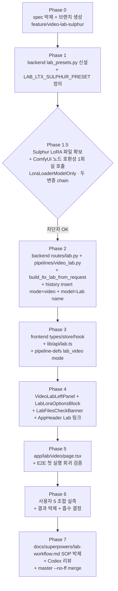

# Video Lab 프레임워크 + Sulphur-2-base 통합 (첫 적용 사례)

**작성일**: 2026-05-15
**상태**: 기획 v4 (v3 → Codex 3차 리뷰 — Important 5건 + 회귀 위험 정정 + scope 분할 권장 + §5 보강 3건 반영)
**작성자**: Opus 4.7 (사용자 공동 기획 · 사용자 결정 6건 · Codex 1차/2차/3차 리뷰 검증)
**대상 파일**: `docs/superpowers/specs/2026-05-15-video-lab-framework-sulphur-design.md`
**참조 구현**:
- `docs/superpowers/specs/2026-05-03-video-model-selection-wan22.md` (LTX/Wan22 듀얼)
- `docs/superpowers/specs/2026-04-24-video-ltx23-design.md` (LTX 단일 spec)

---

## 0. TL;DR — 한 줄 요약

> 신규 영상 모델을 **production `/video` 페이지를 건드리지 않고** 검증할 수 있는 영구 **Lab 프레임워크**를 신설하고, **Sulphur-2-base (LTX 2.3 derivative)** 를 첫 적용 사례로 통합한다. Lab 페이지는 자유 LoRA 토글 + strength slider 등 실험용 옵션을 노출하며, 검증 통과 모델만 production 으로 흡수.

---

## 1. Context — 왜 이 변경이 필요한가

### 1.1 현재 상황

- `/video` 페이지는 **Wan 2.2 i2v (default) + LTX Video 2.3** 듀얼 (2026-05-03 박제 · `2026-05-03-video-model-selection-wan22.md`)
- LTX 의 `adult` LoRA = `ltx2310eros_beta.safetensors` (single · strength 0.5)
- LTX 의 `lightning` distill = `ltx-2.3-22b-distilled-lora-384.safetensors` (base + upscale 두 슬롯)
- 모델 추가 빈도 상승: Wan22 (2026-05-03) → Sulphur (2026-05-15) → 미래 Hunyuan / Mochi / 새 LTX 버전 줄줄이 예상

### 1.2 문제

매번 신규 모델 추가 시 production 인프라 (`pipeline-defs.tsx`, `useVideoStore`, `VideoLeftPanel`, `_dispatch.py`, `presets.py`) 를 흔들면:

1. 5 mode 통일 인프라 회귀 위험 누적 (Generate/Edit/Video/Vision/Compare)
2. UI 옵션 누적 → 사용자 인지 부하 (production 은 안정성 우선)
3. Phase 1 검증 실패 시 git revert 범위 큼
4. 모델별 자유 옵션 (LoRA strength slider 등) production 노출하기 부담

### 1.3 사용자 발견 (2026-05-15 브레인스토밍)

`https://huggingface.co/SulphurAI/Sulphur-2-base` (`gated=false` · EULA 동의 불필요) —
- **LTX 2.3 derivative** (uncensored finetune · NSFW 자체 강화)
- repo 에 full weights (`sulphur_dev_{bf16,fp8mixed}.safetensors` 46.1 / 29.2GB) + distilled full (`sulphur_distil_bf16.safetensors` 46.1GB) + LoRA (`sulphur_lora_rank_768.safetensors` 10.3GB) + distill LoRA (`distill_loras/ltx-2.3-22b-distilled-lora-1.1_fro90_ceil72_condsafe.safetensors`) + prompt enhancer (LM Studio 권장) 모두 있음
- **Phase 1 결정적**: LoRA + distill LoRA 두 파일만 받아서 기존 LTX 워크플로우 무변경 + LoRA chain 확장만으로 통합 가능 (full unet 은 Phase 2 후속)
- 라이선스 = **LTX-2 Community License** (개인 사용 무료 · 우리 LTX 2.3 이미 동일 라이선스라 변화 0 · AUP 준수 필수)

### 1.4 해결 방향

**Lab 페이지 = 영구 prototype 셸**. production /video 페이지는 무손상. 신규 모델은 lab 에서 먼저 검증 → 만족 시 production 흡수.

---

## 2. 사용자 확정 결정 사항 (2026-05-15 브레인스토밍)

| # | 항목 | 결정 | 근거 |
|---|------|------|------|
| 1 | 통합 전략 | **C. 단계적 (A → B)** — Phase 1 = LoRA 만 추가, Phase 2 = 결과 좋으면 full unet | 리스크 관리 |
| 2 | Lab 페이지 범위 | **영구 lab 프레임워크** (SOP 박제) — 미래 모든 신규 모델이 lab 통과 | 워크플로우 명문화 |
| 3 | 메인 노출 | **AppHeader 의 작은 "Lab" 링크** — 메인 그리드 6 카드 무손상 | 안정성 + 접근성 절충 |
| 4 | Sulphur 추가 동기 | **NSFW 품질 강화 + 비교 실험** | 사용자 명시 |
| 5 | Adult LoRA 정책 | **중복 선택 가능 (eros / sulphur 체크박스)** — 둘 다, 하나만, 둘 다 off 가능 | 비교 실험 동기 강화 |
| 6 | Distill LoRA 정책 | **Settings 토글 (default / sulphur 선택)** | 사용자 자유 선택 |

### 2.1 비목표 (YAGNI · Phase 1 범위 명확화)

- **T2V 모드** — Sulphur 네이티브 지원하나, 인터페이스 변경 너무 큼. 별 plan 후속
- **Sulphur full unet swap (29.2GB)** — Phase 2 (별 plan)
- **Sulphur Prompt Enhancer (mmproj-BF16.gguf)** — LM Studio 권장. 우리 gemma4-un 으로 대체. 통합 X
- **Lab 페이지에서 production 모델 (Wan22) 실험 가능 여부** — Phase 1 은 LTX 변종만. Wan22 lab 변종은 후속 별 plan
- **Lab → production 자동 흡수 자동화** — 흡수는 수동 plan 으로
- **Lab 페이지 history 통계 / 비교 시각화 도구** — Phase 1 은 production 과 같은 history table (mode="video") 에 저장 · 시각화는 후속 plan
- **신규 history mode `"lab_video"` 신설** — v1 초안에 있었으나 Codex 리뷰로 폐기 (§5.3 결정 참조). production 인프라 (CHECK 제약 / `_next_save_path` whitelist / `items.py` filter) 회귀 위험 너무 큼

---

## 3. Part A — Video Lab 프레임워크 (영구 SOP)

### 3.1 핵심 원칙

1. **격리**: 신규 모델은 lab 페이지에서 먼저 검증. production /video 페이지는 안정된 모델만.
2. **재사용**: 공통 인프라 (transport / dispatch / SSE / 디자인 토큰 / 진행 모달) 는 그대로 사용.
3. **자유 옵션**: lab 페이지는 LoRA strength slider 등 production 미노출 옵션 노출.
4. **수동 흡수**: lab 검증 통과 모델은 별 plan 으로 production 흡수 (자동화 X).

### 3.2 격리 vs 재사용 정책 (영구 패턴)

| 레이어 | 정책 | 비고 |
|---|---|---|
| ComfyUI transport / 자동기동 / SSE 패턴 | 🟢 재사용 | `comfy_transport.py` / `_dispatch.py` |
| `_gpu_lock.py` / `dispatch_state.py` | 🟢 재사용 | 단일 GPU 큐 |
| `PipelineTimeline` / `ProgressModal` / `DetailBox` | 🟢 재사용 | `frontend/lib/pipeline-defs.tsx` 에 `"lab_video"` PipelineMode 추가 (UI 식별용 · backend mode 와 별개) |
| `HistoryGallery` / `ResultHoverActionBar` / `BeforeAfterSlider` | 🟢 재사용 | 4메뉴 통일 컴포넌트 |
| 디자인 토큰 (`.ais-result-hero` / `.ais-cta-primary` / 그리드 `400px minmax(624px, 1fr)`) | 🟢 재사용 | 시각 일관성 |
| LoRA chain builder (LTX) | 🟢 재사용 (변형) | `_build_ltx` 의 LoRA chain 빌드 로직 |
| Routes | 🔴 격리 | `backend/studio/routes/lab.py` (신규) |
| Pipeline | 🔴 격리 | `backend/studio/pipelines/video_lab.py` (신규) |
| Preset 정의 | 🔴 격리 | `backend/studio/lab_presets.py` (신규) |
| Frontend page | 🔴 격리 | `frontend/app/lab/video/page.tsx` (신규) |
| Frontend store / hook / LeftPanel | 🔴 격리 | `frontend/stores/useVideoLabStore.ts` / `frontend/hooks/useVideoLabPipeline.ts` / `frontend/components/studio/lab/VideoLabLeftPanel.tsx` |
| Frontend API client | 🔴 격리 | `frontend/lib/api/lab.ts` (신규) |
| History DB | 🟢 **변경 0** | `mode="video"` 유지 + `model="LTX 2.3 · Sulphur Lab"` display name 으로 lab 식별. SCHEMA_VERSION=10 그대로. CHECK 제약 / `_next_save_path` whitelist / `items.py` filter 모두 무손상 (Codex 리뷰 권장 옵션 B) |
| 저장 경로 | 🟢 변경 0 | mode="video" 유지 → `STUDIO_OUTPUT_DIR/video/YYYY-MM-DD/` 폴더에 저장 (production 과 동일 경로) |
| ComfyUI LoRA 디렉토리 | 🟢 설정 기반 | 하드코딩 X. `config.comfyui_base_dir` + ComfyUI `/object_info` 의 `LoraLoaderModelOnly.lora_name` 목록 조회 (Files Check Banner 의 진실원) |

### 3.3 SOP 문서 (`docs/superpowers/lab-workflow.md` 신설)

신규 모델 도입 절차 명문화:

```
1. 신규 모델 발견
   ├─ HuggingFace / GitHub / X 등 소스
   ├─ 라이선스 확인 (commercial 제약 등)
   └─ ComfyUI 호환성 확인 (custom node 필요 여부)

2. Lab Preset 정의
   ├─ backend/studio/lab_presets.py 에 *_LAB_PRESET 추가
   ├─ frontend/lib/lab-presets.ts mirror (자동 동기화 또는 손 미러)
   └─ 파일 다운로드 안내 (README 또는 도움말 텍스트)

3. Lab 검증 (실측)
   ├─ /lab/video 페이지에서 동일 source + prompt + seed 로 N 조합 실측
   ├─ 시각 비교 (사용자 만족도)
   └─ 만족 / 불만족 결정

4. 흡수 (만족 시)
   ├─ 별 plan 작성 (production /video 페이지 통합)
   ├─ LoRA 만이면 LTX_VIDEO_PRESET.loras 확장
   ├─ Full unet 이면 model_id 신설 (Wan22 패턴)
   └─ Lab preset 유지 또는 제거 (사용자 결정)

5. 불만족 시
   ├─ Lab preset 그대로 두기 (참조용)
   └─ 또는 lab_presets.py 에서 제거 (cleanup)
```

### 3.4 데이터 흐름 (Lab Video)

```
[VideoLabLeftPanel]                       [routes/lab.py /api/studio/lab/video]
  Source ──┐                                 parse multipart meta
  Prompt ──┤                                 ↓
  Lightning toggle ──┤                       preset = LAB_LTX_SULPHUR_PRESET
  Distill variant radio ──┤                  ↓
  Adult eros checkbox ──┤                    pipelines/video_lab._run_video_lab_pipeline_task
  Adult sulphur checkbox ──┤                  ├ build_ltx_lab_from_request (NEW)
  LoRA strength sliders ──┘                   ├ ComfyUI dispatch (공용 _dispatch.py)
                                              ├ _save_comfy_video (공용 · mode="video" → video/YYYY-MM-DD/)
                                              └ history insert (mode="video", model="LTX 2.3 · Sulphur Lab")
```

### 3.5 미래 확장 (이번 plan 미포함)

- `/lab/image` — 신규 이미지 모델 검증 (FLUX 변종, SD3.5, 새 Qwen 등)
- `/lab/vision` — 신규 비전 모델 검증 (qwen3-vl 변종, 32B 비교 등)
- 자동 A/B 비교 도구 (같은 prompt 두 모델 동시 실행 → side-by-side)
- Lab 결과 history 별 통계 (모델별 평균 생성 시간 / 사용자 만족도 태그)

---

## 4. Part B — Sulphur 통합 (첫 적용 사례)

### 4.1 파일 다운로드 (사용자 수동)

#### 4.1.1 Sulphur repo 사실관계 (Codex 리뷰 정정)

HuggingFace `https://huggingface.co/SulphurAI/Sulphur-2-base` 는 **gated=false** (인증 토큰 / EULA 클릭 동의 불필요 · `huggingface-cli download` 또는 브라우저 직접 다운로드 가능). repo 에는 다음 자산이 **모두** 있음:

| 파일 | 크기 | Phase 1 사용 여부 |
|---|---|---|
| `sulphur_dev_bf16.safetensors` | 46.1 GB | ❌ (Phase 2 후속) |
| `sulphur_dev_fp8mixed.safetensors` | 29.2 GB | ❌ (Phase 2 후속) |
| `sulphur_distil_bf16.safetensors` | 46.1 GB | ❌ (distilled full · Phase 1 미사용) |
| `sulphur_lora_rank_768.safetensors` | **10.3 GB** | ✅ Adult LoRA |
| `distill_loras/ltx-2.3-22b-distilled-lora-1.1_fro90_ceil72_condsafe.safetensors` | **631 MB** (662,072,824 bytes · HF API 실측) | ✅ Distill LoRA (Sulphur 변종) |
| `prompt_enhancer/sulphur_prompt_enhancer_model-q8_0.gguf` + `mmproj-BF16.gguf` | - | ❌ (LM Studio 권장 · 우리 gemma4-un 대체) |
| `workflows/ltx23_t2v distilled.json` | - | ❌ (T2V · 별 plan) |

⚠️ v1 초안의 "LoRA only 배포" 는 부정확. **repo 에 full weights / distilled full / LoRA / prompt enhancer 모두 있음**. Phase 1 은 **LoRA + distill LoRA 두 파일만** 사용 (위 ✅ 두 항목).

#### 4.1.2 다운로드 + 배치

오빠가 위 두 ✅ 파일을 받아 **ComfyUI LoRA 디렉토리** 에 배치. 디렉토리 위치는 `backend/config.py` 의 `comfyui_base_dir` 설정값 + ComfyUI 의 `extra_model_paths.yaml` (`comfyui_extra_paths_config`) 에 따라 결정 — 하드코딩 X.

**파일 경로 정책**:
- HF repo 의 `distill_loras/ltx-2.3-22b-distilled-lora-1.1_fro90_ceil72_condsafe.safetensors` 는 **basename 만** 사용해 `loras/` 루트 폴더에 배치 권장. ComfyUI 가 subfolder 도 enum 으로 노출하나, 단순성 + 회귀 위험 회피.
- LAB_LTX_SULPHUR_PRESET 의 `file_name` 은 basename 만 박제 (subpath X). Files Check Banner 의 검증 로직도 basename 만 매칭.
- 만약 사용자가 subfolder 에 두고 싶으면 `extra_model_paths.yaml` 의 `loras:` 목록에 그 폴더 추가 + LAB preset 의 `file_name` 도 정확히 그 subpath 로 변경 (plan 단계 결정 X · 사용자 선택).

검증 방법 — lab 페이지 진입 시 `GET /api/studio/lab/video/files` 호출:
1. ComfyUI `/object_info` 의 `LoraLoaderModelOnly.input.required.lora_name` ENUM 목록 조회 (실제 ComfyUI 가 인식하는 LoRA 파일 목록 = 진실원)
2. 두 ✅ 파일 basename 이 목록에 없으면 frontend 가 "파일 없음" Banner 표시 + HF 다운로드 링크 안내
3. 첫 E2E 실행 차단 (파일 부재 시 `POST /api/studio/lab/video` 가 400 응답)

### 4.2 Backend 변경

#### 4.2.1 `backend/studio/lab_presets.py` (신규)

```python
"""lab_presets.py - Lab 검증용 모델 프리셋.

production presets.py 와 격리. Lab 페이지에서만 사용.
신규 모델은 여기 추가 → 검증 후 만족 시 별 plan 으로 production 흡수.
"""
from __future__ import annotations
from dataclasses import dataclass, field
from typing import Literal

from .presets import (
    LTX_VIDEO_PRESET,
    VideoFiles,
    VideoLoraEntry,
    VideoSampling,
)


@dataclass(frozen=True)
class LabLoraOption:
    """Lab 페이지에서 토글 가능한 LoRA 옵션.

    role 은 production VideoLoraEntry 와 호환되지만, sub-key 로 더 세분화
    (예: "adult_eros" / "adult_sulphur") — 여러 변종이 같은 카테고리에 있을 때.

    applies_to: lightning role 의 경우 빌더가 같은 LoRA 를 **두 엔트리로 expand**
    해서 순차 LoRA chain (model_ref 흐름) 에 적용. production `presets.py:391-402`
    가 동일 distill LoRA `VideoLoraEntry` 두 개를 note="base"/"upscale" 로 박제했고
    `comfy_api_builder/video.py:246-250` 가 `active_loras` 를 단일 `model_ref` 체인
    으로 빌드 → base/upscale guider 모두 같은 model_ref 사용 (`video.py:351,442`).

    즉 "두 슬롯" 이 시각적 분리가 아니라 **LoraLoaderModelOnly 두 호출의 순차 적용**
    이다. LabLoraOption.applies_to 는 이 expand 정책의 신호 (실제 빌더가 같은 파일을
    두 번 chain 에 추가하라는 의미).
    """
    id: str  # frontend 가 토글 식별 ("adult_eros", "adult_sulphur", "distill_default", "distill_sulphur")
    display_name: str  # UI 라벨
    file_name: str  # safetensors 파일명
    default_strength: float
    strength_min: float = 0.0
    strength_max: float = 1.5
    strength_step: float = 0.05
    role: Literal["lightning", "adult"] = "adult"
    applies_to: tuple[str, ...] = ("single",)  # lightning 이면 ("base", "upscale"), adult/single 이면 ("single",)
    note: str = ""


@dataclass(frozen=True)
class LabVideoModelPreset:
    """Lab 영상 모델 프리셋. production VideoModelPreset 과 다른 구조."""
    id: str  # "ltx-sulphur" 등 frontend 식별자
    display_name: str
    tag: str
    base_files: VideoFiles  # 기존 LTX 2.3 파일 재사용
    lora_options: list[LabLoraOption]  # 사용자가 토글로 활성/비활성 선택
    sampling: VideoSampling  # 기존 LTX VideoSampling 재사용
    negative_prompt: str
    notes_md: str  # UI 도움말 (다운로드 안내 + 검증 가이드)


# ── Sulphur-2 LTX 변종 (Phase 1 첫 적용) ──
LAB_LTX_SULPHUR_PRESET = LabVideoModelPreset(
    id="ltx-sulphur",
    display_name="LTX 2.3 · Sulphur Lab",
    tag="LoRA 검증",
    base_files=LTX_VIDEO_PRESET.files,  # text_encoder / upscaler / unet 모두 재사용
    lora_options=[
        # Distill (Lightning) 변종 — radio (default / sulphur). applies_to=("base","upscale")
        # → 빌더가 자동으로 LTX 워크플로우의 두 distill 슬롯에 같은 파일 적용
        # (production presets.py:391-402 의 동일 파일 두 엔트리 패턴 미러).
        LabLoraOption(
            id="distill_default",
            display_name="Distill: Default (384)",
            file_name="ltx-2.3-22b-distilled-lora-384.safetensors",
            default_strength=0.5,
            role="lightning",
            applies_to=("base", "upscale"),
            note="기존 LTX distill (production baseline 과 동일)",
        ),
        LabLoraOption(
            id="distill_sulphur",
            display_name="Distill: Sulphur (1.1_fro90)",
            file_name="ltx-2.3-22b-distilled-lora-1.1_fro90_ceil72_condsafe.safetensors",
            default_strength=0.5,
            role="lightning",
            applies_to=("base", "upscale"),
            note="Sulphur 권장 distill (Sulphur LoRA 와 세트)",
        ),
        # Adult LoRA — checkbox (eros / sulphur · 둘 다 가능)
        LabLoraOption(
            id="adult_eros",
            display_name="Adult: Eros",
            file_name="ltx2310eros_beta.safetensors",
            default_strength=0.5,
            role="adult",
            note="기존 production adult LoRA",
        ),
        LabLoraOption(
            id="adult_sulphur",
            display_name="Adult: Sulphur",
            file_name="sulphur_lora_rank_768.safetensors",
            default_strength=0.7,  # README 미명시 · 추측값
            role="adult",
            note="Sulphur 2 NSFW finetune (10.3GB · 첫 실측 0.7 시작)",
        ),
    ],
    sampling=LTX_VIDEO_PRESET.sampling,
    negative_prompt=LTX_VIDEO_PRESET.negative_prompt,
    notes_md=(
        "Sulphur-2-base 검증용. HuggingFace SulphurAI/Sulphur-2-base "
        "(gated=false · EULA 동의 불필요) 에서 "
        "`sulphur_lora_rank_768.safetensors` (10.3GB) + "
        "`ltx-2.3-22b-distilled-lora-1.1_fro90_ceil72_condsafe.safetensors` "
        "받아 ComfyUI LoRA 디렉토리 (`comfyui_base_dir/models/loras/` 또는 "
        "`extra_model_paths.yaml` 의 loras 항목 위치) 에 배치."
    ),
)

# Lab 페이지에서 노출할 preset 목록 (미래 추가 시 여기에)
LAB_VIDEO_PRESETS: list[LabVideoModelPreset] = [LAB_LTX_SULPHUR_PRESET]


def get_lab_video_preset(preset_id: str) -> LabVideoModelPreset:
    """preset_id → preset 인스턴스 dispatch.

    Raises:
        ValueError: 알 수 없는 preset_id
    """
    for p in LAB_VIDEO_PRESETS:
        if p.id == preset_id:
            return p
    raise ValueError(f"unknown lab video preset: {preset_id!r}")
```

#### 4.2.2 `backend/studio/routes/lab.py` (신규)

```python
"""routes/lab.py - Lab 페이지 endpoint.

production /api/studio/video 와 격리. 같은 ComfyUI 인프라 사용하지만
별 router 라 회귀 위험 0.
"""
from fastapi import APIRouter, UploadFile, File, Form
# ... (생략)

router = APIRouter(prefix="/lab", tags=["lab"])  # 모듈명은 lab.router (옛 라우터 패턴 미러)

# backend/studio/routes/__init__.py 에 다음 라인 추가:
#   from . import (compare, lab, prompt, prompt_favorites, ...)  # lab 추가
#   studio_router.include_router(lab.router)                     # 등록
# studio_router 의 prefix="/api/studio" + lab.router 의 prefix="/lab" 합쳐서
# 최종 path = "/api/studio/lab/video", "/api/studio/lab/video/stream/{task_id}"


@router.get("/video/files")
async def check_lab_video_files() -> dict:
    """Lab 페이지 진입 시 호출. 필수 LoRA 파일 존재 여부 응답.

    진실원 = ComfyUI `/object_info` 의 `LoraLoaderModelOnly.lora_name` ENUM 목록.
    파일 시스템 직접 조회 X (extra_model_paths 다중 위치 / 심볼릭 링크 / 대소문자
    민감도 등 복잡성 회피).

    frontend 가 파일 부재 시 "다운로드 안내" Banner 표시.
    """
    # comfy_transport 통해 GET {comfyui_url}/object_info 호출
    # → LoraLoaderModelOnly.input.required.lora_name ENUM 목록 파싱
    # → LAB_VIDEO_PRESETS 의 모든 lora_options.file_name 이 목록에 있는지 확인
    # → {"missing": [...], "all_present": bool} 응답
    ...


@router.post("/video")
async def create_lab_video_task(
    image: UploadFile = File(...),
    meta: str = Form(...),  # JSON string with preset_id / active_lora_ids / strengths / prompt / etc.
) -> dict:
    """Lab 영상 task 생성. production /video 와 같은 task-based SSE 패턴."""
    ...


@router.get("/video/stream/{task_id}")
async def lab_video_stream(task_id: str) -> StreamingResponse:
    """SSE stream — production 과 동일 패턴 (stage events + done)."""
    ...
```

#### 4.2.3 `backend/studio/pipelines/video_lab.py` (신규)

```python
"""pipelines/video_lab.py - Lab 영상 파이프라인.

production pipelines/video.py 와 격리. 같은 ComfyUI dispatch / GPU lock /
SSE 패턴 재사용. 차이점:
  - lab_presets.LabVideoModelPreset 받음 (LoRA 자유 선택)
  - build_ltx_lab_from_request 호출 (LoRA chain 자유)
  - history insert: mode="video" (production 과 동일 · CHECK 제약 / whitelist 무손상)
    + model="LTX 2.3 · Sulphur Lab" (display_name 으로 lab 식별)
  - _dispatch_to_comfy(mode="video") → _next_save_path("video", ext) (whitelist 통과)
"""
# ... (생략 · pipelines/video.py 의 _run_video_pipeline_task 패턴 미러)


def build_ltx_lab_from_request(
    preset: LabVideoModelPreset,
    active_lora_ids: list[str],
    strength_overrides: dict[str, float],  # {"adult_sulphur": 0.8} 등
    source_image_path: str,
    prompt: str,
    seed: int,
    longer_edge: int,
    lightning_on: bool,
    # ... 기타 sampling 파라미터
) -> dict:
    """ComfyUI workflow JSON 빌드. _build_ltx 의 변형 — LoRA chain 자유.

    - active_lora_ids 에 있는 lora_options 만 chain 에 포함
    - lightning_on=False 면 role=="lightning" 자동 제외
    - strength_overrides 가 있으면 default_strength 대신 사용
    """
    ...
```

#### 4.2.4 `backend/studio/history_db/` (**변경 0** — Codex 리뷰 권장 옵션 B)

v1 초안의 SCHEMA_VERSION 8→9 migration 은 **폐기**.

```python
# backend/studio/history_db/schema.py 변경 0
# - SCHEMA_VERSION = 10 (현재 그대로)
# - CREATE TABLE studio_history (
#     mode TEXT NOT NULL CHECK(mode IN ('generate','edit','video')),  # 변경 0
#     ...
#   )
# - items.py:85 `if mode in ("generate", "edit", "video")` 변경 0

# Lab 영상 결과 insert (video_lab.py 파이프라인 안에서):
# items.py:49 가 item["imageRef"] (camelCase) 요구 — snake_case 쓰면 KeyError.
# 기타 필드도 모두 camelCase (createdAt, upgradedPrompt, sourceRef, durationSec 등).
await history_db.insert_item({
    "mode": "video",                          # production 과 동일 (CHECK 통과)
    "model": "LTX 2.3 · Sulphur Lab",         # display_name 으로 lab 식별
    "prompt": prompt,
    "label": label,
    "imageRef": save_url,                     # video/YYYY-MM-DD/video-HHMM-NNN.mp4
    "createdAt": now_ms,
    # ... 기타 필드 production video insert 패턴 그대로
})

# 프론트엔드는 `model` 컬럼이 "Lab" 단어를 포함하는지 검사해 갤러리에
# Lab 배지 (cyan/violet 시그니처) 노출 — 별 mode / metadata 컬럼 불필요.
```

⚠️ **장점 (옵션 B 선택 근거)**: production 인프라 (`schema.py:62` CHECK / `storage.py:262` whitelist / `items.py:85` filter / frontend `HistoryMode` Literal) 전부 무손상. 회귀 위험 최저.

⚠️ **후속 옵션 C (별 plan 후보)**: lab history 통계 / 필터링 / A-B 비교 도구가 필요해질 때 → SCHEMA_VERSION 11 + `lab_metadata TEXT` 컬럼 idempotent ADD. 별 plan 으로.

### 4.3 Frontend 변경

#### 4.3.1 신규 파일

| 파일 | 역할 |
|---|---|
| `frontend/app/lab/video/page.tsx` | Lab 영상 페이지 (production /video 와 같은 grid 레이아웃) |
| `frontend/stores/useVideoLabStore.ts` | Lab 영상 상태 (preset_id, active_lora_ids, strengths, prompt 등). **PipelineTimeline 호환 필수**: `stageHistory: StageEvent[]` + `running: boolean` 필드 명시 (`useVideoStore` / `useEditStore` 미러 — `progress/PipelineTimeline.tsx:175` `usePipelineRuntime` 이 같은 인터페이스 요구) |
| `frontend/hooks/useVideoLabPipeline.ts` | Lab 영상 파이프라인 (SSE drain · production useVideoPipeline 패턴) |
| `frontend/components/studio/lab/VideoLabLeftPanel.tsx` | Lab 영상 LeftPanel (자유 LoRA 옵션 노출) |
| `frontend/components/studio/lab/LabLoraOptionsBlock.tsx` | LoRA 토글 + strength slider UI 블록 |
| `frontend/components/studio/lab/LabFilesCheckBanner.tsx` | LoRA 파일 부재 시 다운로드 안내 배너 |
| `frontend/lib/api/lab.ts` | Lab API SSE drain |
| `frontend/lib/lab-presets.ts` | backend `lab_presets.py` mirror |

#### 4.3.2 기존 파일 수정

| 파일 | 변경 |
|---|---|
| `frontend/lib/pipeline-defs.tsx` | `PipelineMode` union 에 `"lab_video"` 추가 + `PIPELINE_DEFS["lab_video"]` 정의 (5 stage · video 와 동일). **UI 식별용** (backend history mode 와 별개 · backend 는 mode="video" 저장) |
| `frontend/components/studio/ProgressModal.tsx` | **🔴 동기화 3 곳 필수** — (a) `MODE_TITLES` (line 35) 에 `lab_video: "Lab 영상 생성 중"` 추가 (TS error 회피), (b) `usePipelineRunning()` (line 147-158) 에 `lab_video` 분기 추가 + `useVideoLabStore` 의 `running` 구독 (누락 시 compareRunning 으로 fallback), (c) `useComfyInterruptAvailability()` (line 118-144) 에 `lab_video` 분기 추가 (누락 시 interrupt 버튼 비활성) |
| `frontend/components/studio/progress/PipelineTimeline.tsx` | **🔴 동기화 2 곳 필수** — (a) `usePipelineRuntime` (line 175) 에 `useVideoLabStore` 분기 (stageHistory/running 구독), (b) `usePipelineCtx` (line 234-254) 의 `promptMode / hideVideoPrompts / videoModelId / visionModel` 분기 — 현재 `mode === "video"` 기준이라 `lab_video` 도 **video-like 로 처리** 또는 lab 전용 `PIPELINE_DEFS["lab_video"]` 가 해당 ctx 안 쓰는 stage 정의로 결정 (plan 단계 결정) |
| `frontend/components/chrome/ModeNav.tsx` | 중앙 nav 의 진실원 (line 32). "Lab" 링크 추가 (활성 시 violet 시그니처). AppHeader 의 `center={<ModeNav />}` 가 이 컴포넌트를 사용 |
| `frontend/components/chrome/AppHeader.tsx` | 변경 0 (ModeNav 가 자동 반영). 만약 헤더 우측 Lab 배지 추가 시에만 수정 |
| `frontend/stores/useSettingsStore.ts` | `labVideoPresetId: string` persist (마지막 선택 preset) |
| `frontend/lib/api/types.ts` | `LabVideoRequest` / `LabVideoStageEvent` 등 한글 주석 타입 (narrow union) |
| `frontend/components/studio/HistoryTile.tsx` | line 151 `item.mode === "video"` 분기에서 `shortVideoModelLabel(item.modelId, item.model)` 호출. **신규 model name "LTX 2.3 · Sulphur Lab" 대응 필수** — `shortVideoModelLabel` (HistoryTile.tsx:233) 의 첫 분기 (`modelId === "ltx"` 또는 `/ltx/i`) 가 "LTX 2.3" 으로 축약 시 Lab 식별 사라짐. **Lab 검사 순서 = 첫 줄에서 `model` 이 exact match `"LTX 2.3 · Sulphur Lab"` 인지 먼저 확인 (includes "Lab" 보다 exact match 가 false-positive 회피)**. 매칭되면 그대로 노출 + 별 Lab 배지 (cyan/violet) 분기 추가 |

#### 4.3.3 `VideoLabLeftPanel.tsx` UI 구조

```
┌─ Preset 선택 (dropdown · 1차는 "LTX 2.3 · Sulphur Lab" 만) ──┐
│ ─────────────────────────────────────────────────── │
│ ┌─ Distill (Lightning) LoRA ─────────────────────┐ │
│ │ ○ Default (384)                                  │ │
│ │ ● Sulphur (1.1_fro90)                           │ │
│ │   strength: [▬▬▬▬●▬▬] 0.5                      │ │
│ └─────────────────────────────────────────────────┘ │
│ ┌─ Adult LoRA (중복 선택 가능) ──────────────────┐ │
│ │ ☐ Eros                                           │ │
│ │   strength: [▬▬▬▬●▬▬] 0.5                      │ │
│ │ ☑ Sulphur                                        │ │
│ │   strength: [▬▬▬▬▬●▬] 0.7                      │ │
│ └─────────────────────────────────────────────────┘ │
│ ┌─ Lightning 토글 ─────────────────────────────────┐ │
│ │ [ON / OFF]                                        │ │
│ └─────────────────────────────────────────────────┘ │
│ ┌─ Sampling 자유 옵션 (lab 만) ────────────────────┐ │
│ │ Sampler / Scheduler / Shift (default LTX 값 노출) │ │
│ └─────────────────────────────────────────────────┘ │
├─ 해상도 슬라이더 (production 과 동일) ──────────────┤
├─ Source Image ─────────────────────────────────────┤
├─ Prompt ───────────────────────────────────────────┤
└─ CTA: "Lab 영상 생성" ─────────────────────────────┘
```

### 4.4 검증 프로토콜 (Phase 1 → Phase 2 진행 판단)

동일 source image + prompt + seed 로 5 조합 실측:

| # | Distill | Adult |
|---|---------|-------|
| 1 | default (384) | eros only (baseline = production 과 같음) |
| 2 | default (384) | sulphur only (Adult LoRA 만 변화) |
| 3 | sulphur (1.1_fro90) | eros only (Distill 만 변화) |
| 4 | sulphur (1.1_fro90) | sulphur only (둘 다 Sulphur · 원의도) |
| 5 | sulphur (1.1_fro90) | eros + sulphur 동시 (강도 비교) |

→ 시각 비교 + 사용자 만족도 평가 → 최선 조합 선택 → **흡수 결정**:

- **Sulphur LoRA 명확히 우월** → Phase 2 plan 작성 (production `LTX_VIDEO_PRESET.loras` 확장)
- **Full unet 도 효과** → Phase 3 plan (`model_id="sulphur"` 신설 · Wan22 패턴)
- **효과 미약** → lab preset 만 유지 (참조용) 또는 제거

---

## 5. 의문점 / Open Questions (plan 단계에서 해소)

### 5.1 🟡 Sulphur LoRA strength 시작값
README 미명시. 0.7 은 추측. 실측 후 0.5 / 0.7 / 1.0 비교 필요. Lab 페이지의 strength slider 가 정확히 이 의문 해소용.

### 5.2 🟡 Sulphur distill + Sulphur LoRA 동시 적용 호환성
README 명시 X. LTX eros + 384-distill 처럼 무난할 가능성. 첫 실측 (조합 #4) 에서 확인.

### 5.3 ✅ history DB mode 추가 방식 (Codex 리뷰 후 결정)
v1 초안에서 검토했던 3 옵션:
- 옵션 A: `lab_video` mode 신설 + SCHEMA_VERSION 11 + 테이블 재생성 마이그레이션 (CHECK 변경)
- 옵션 B: `mode="video"` 유지 + `model="LTX 2.3 · Sulphur Lab"` display name 으로 구분
- 옵션 C: `mode="video"` + SCHEMA_VERSION 11 ADD COLUMN `lab_metadata TEXT`

**결정**: **옵션 B 채택** (Codex 리뷰 권장). 이유:
- production 인프라 (`schema.py:62` CHECK / `storage.py:262` whitelist / `items.py:85` filter / frontend `HistoryMode` Literal) 회귀 위험 0
- 첫 검증 단계 (Phase 1) 에서 통계 도구 불필요 — display name 만으로 식별 충분
- 후속 lab 통계 도구가 필요해지면 옵션 C 로 진화 (별 plan)

### 5.4 🟡 Lab strength slider 범위
- 권장: 0.0 ~ 1.5 (LoRA 보편적 안전 범위)
- step: 0.05
- LoRA 별로 다른 범위 필요할 수 있음 (예: adult_sulphur 는 0.5~1.0 으로 좁히기?)

### 5.5 🟡 ComfyUI workflow JSON 호환성 (Sulphur LoRA chain)
Sulphur LoRA 가 LTX 2.3 `LoraLoaderModelOnly` 노드와 호환됨이 README "LTX 2.3 의 모든 포맷 지원" 으로 추정. 첫 E2E 에서 확인 (Phase 1.5 hard blocker — Wan22 spec 의 ComfyUI `/object_info` 캡처 패턴 미러).

추가로 `LoraLoaderModelOnly.lora_name` ENUM 의 실 목록을 사용해 **Files Check Banner** 의 진실원으로 사용 (§4.1.2 참조).

### 5.6 🟢 Lab 페이지에 Wan22 변종 실험 가능성
Phase 1 = LTX 변종만. 미래 Wan22 fp8_scaled, 새 Lightx2v 버전 등 실험 시 LAB_VIDEO_PRESETS 에 별 entry 추가.

### 5.7 🟢 AppHeader Lab 링크 활성 상태 시그니처
violet (Vision 패턴) vs 별 색 (예: cyan / 노란 시그니처). 디자인 단계에서 결정.

### 5.8 🟡 Sulphur LoRA + 기존 LTX adult LoRA 동시 호환성
첫 검증 조합 #5 (`eros + sulphur 동시`) 가 LoRA chain 적용 시 충돌 / NaN / 불안정 가능성. 실측 시 결과 영상이 garbled 면 동시 적용 불가 — UI 에서 mutual-exclusive 로 강제 변경 검토.

### 5.9 🟡 Phase 1.5 hard blocker 통과 기준 강화 (Codex 3차)
v3 의 "ComfyUI `/object_info` 1회 호출" 만으로는 부족. **실제 generated workflow JSON 을 ComfyUI 에 queue → mp4 저장까지 1회 통과 + 모든 `class_type` (LoraLoaderModelOnly · CheckpointLoaderSimple · LTXVImgToVideoInplace · LTXVPreprocess · ResizeImageMaskNode · CreateVideo · SaveVideo 등) 이 `/object_info` 에 존재 확인** 까지 hard blocker.

### 5.10 🟡 Lab history 표시 범위 (Codex 3차)
`backend/studio/history_db/items.py:85-87` 의 `list_items` 가 **mode 필터만 지원** (`if mode in ("generate","edit","video")`). `/lab/video` 페이지의 HistoryGallery 가 video 결과 전체 (production + lab) 를 보여줄지, 아니면 frontend 에서 `model === "LTX 2.3 · Sulphur Lab"` exact match 로 클라이언트 필터링 할지 결정 필요. plan 단계에서 결정.

### 5.11 🟡 GGUF / Prompt Enhancer 후속 통합 blocker (Codex 3차)
§2.1 비목표로 Prompt Enhancer (mmproj-BF16.gguf · LM Studio 권장) 제외 박제. 후속 plan (§9 #8) 에서 통합 시 GGUF 노드 / LM Studio 호환성 / mmproj 별 blocker 명시 필요.

---

## 6. Phase 분할 제안 (plan 작성 시 참고)



각 Phase 의 예상 task 수 (plan 단계에서 정확화):
- Phase 0: 1 task (브랜치)
- Phase 1: 3 task (lab_presets.py · 단위 테스트 · frontend mirror)
- Phase 1.5: 1 task (hard blocker — ComfyUI 호환성 + Files Check `/object_info` 캡처)
- Phase 2: 4 task (routes · pipeline · builder · 단위 테스트 · *history schema migration 폐기*)
- Phase 3: 5 task (types · store · hook · API client · pipeline-defs)
- Phase 4: 4 task (LeftPanel · LoraOptionsBlock · FilesCheckBanner · ModeNav Lab 링크 + HistoryTile Lab 배지)
- Phase 5: 3 task (page · E2E · 회귀 검증)
- Phase 6: 1 task (사용자 실측 + 결과 박제)
- Phase 7: 2 task (SOP 문서 · merge)

**총 약 20 task** (v1 의 25 task → Codex 1차 리뷰 후 history mode 신설 폐기로 5 task 감소).

### 6.1 Plan 분할 권장 (Codex 3차 리뷰 — plan 단계 결정)

단일 plan 으로 가도 OK 하지만, backend / frontend / E2E 가 모두 한 plan 에 묶이면 PR 리뷰 부담 큼. **3분할 권장**:

- **Plan A**: Phase 0 (브랜치) + Phase 1 (`lab_presets.py`) + Phase 1.5 (ComfyUI hard blocker — `/object_info` 캡처 + 샘플 mp4 1회 저장)
- **Plan B**: Phase 2 (backend `routes/lab.py` + `pipelines/video_lab.py` + builder + history insert) + 단위 테스트
- **Plan C**: Phase 3~5 (frontend store/hook/api/pipeline-defs · LeftPanel/LoraOptionsBlock/FilesCheckBanner · page · E2E) + Phase 6 (사용자 실측) + Phase 7 (SOP + merge)

오빠가 단일 plan 선호 시 Phase 0~7 통합 진행. 분할 선호 시 Plan A 먼저 → 검증 → Plan B → Plan C 순.

---

## 7. 회귀 영향 / 테스트

### 7.1 Backend 회귀

- 신규 파일 (`lab_presets.py` / `routes/lab.py` / `pipelines/video_lab.py`) → 기존 production 코드 무손상
- `history_db/` 변경 **0** (옵션 B 결정 — §5.3): SCHEMA_VERSION 10 그대로 / CHECK 무변경 / `items.py:85` whitelist 무변경
- `storage.py` 변경 **0**: lab 영상은 `mode="video"` 로 저장 → `_next_save_path("video", "mp4")` 가 `video/YYYY-MM-DD/` 폴더 통과
- ⚠️ **회귀 위험 0 은 DB/storage/history mode 레이어에서만 의미**. UI 식별 (HistoryTile 의 Lab 배지) 의 false-positive 위험은 별 검토 — Codex 3차 리뷰 권장 = `model` exact match `"LTX 2.3 · Sulphur Lab"` 사용 + 검사 순서를 `modelId === "ltx"` 분기보다 앞에 배치
- 예상 pytest: 현재 **581** → 약 +12 (lab preset / lab pipeline / lab route 신규 테스트 — schema migration 테스트 폐기로 -3)

### 7.2 Frontend 회귀

- 신규 파일 (`frontend/app/lab/...` / store / hook / LeftPanel / api / pipeline-defs entry) → 기존 production 무손상
- `frontend/components/chrome/AppHeader.tsx` 의 "Lab" 링크 추가 → 시각 회귀 위험 (디자인 일관성 검증 필요)
- `frontend/stores/useSettingsStore.ts` 의 `labVideoPresetId` persist 추가 → 옛 사용자 store hydration 안전 (default 값 있음)
- `frontend/components/studio/HistoryTile.tsx` 의 Lab 배지 분기 (`shortVideoModelLabel` line 233 갱신 + `model` 컬럼에 "Lab" 포함 검사) → 기존 production 결과는 미영향
- 예상 vitest: 현재 **337** → 약 +10 (lab store / hook / LeftPanel / Lab 배지 신규 테스트)

### 7.3 통합 검증

- Phase 5 E2E: lab 페이지 첫 실행 회귀 (파일 부재 시 배너 / 파일 있을 시 정상 실행)
- Phase 6 사용자 실측: 5 조합 동일 source · 시각 비교

---

## 8. 라이선스 / 법적 고려

- Sulphur-2-base 라이선스 = **LTX-2 Community License** (Lightricks Ltd., 2026-01-05 · LTX 2.3 derivative 라 상속)
- 우리 LTX 2.3 가 이미 동일 라이선스 사용 중 → Sulphur 추가해도 라이선스 측면 변화 0
- **상업 사용**: 연 매출 $10M 미만 entity = 무료. $10M 이상 = 별도 paid Commercial Use Agreement 필요
- **Acceptable Use Policy (Attachment A) 전체 준수 필수**: AI 생성 disclosure, 미성년 보호, 비동의 deepfake 금지, 차별/괴롭힘/사기 금지, 의료/법률 자문 금지 등 18개 조항 (구체 목록은 LICENSE.txt 참조)
- 우리 환경 = 1인 로컬 사용 + 매출 기준 미달 + AUP 위반 의도 없음 = **개인 검증 사용 OK**
- ⚠️ 만약 추후 공개/상업 배포 / SaaS 제공 등으로 확장하면 라이선스 / AUP 재검토 필요

---

## 9. 후속 plan 후보 (이번 plan 미포함)

1. **Phase 2 plan**: Sulphur LoRA → production `/video` 흡수 (lab 검증 통과 시)
2. **Phase 3 plan**: Sulphur full unet (29.2GB fp8mixed 또는 46.1GB bf16) → `model_id="sulphur"` 신설. ⚠️ README 명시 — "LoRA 또는 full model 중 하나만 사용 (둘 동시 금지)". UI 에서 full 모델 선택 시 Sulphur LoRA 자동 비활성 (mutual-exclusive 강제)
3. **T2V 모드 신설** (Sulphur 네이티브 지원 · 별 인터페이스 · `workflows/ltx23_t2v distilled.json` 활용)
4. **`/lab/image` 신설** (FLUX / SD3.5 / 새 Qwen 검증)
5. **`/lab/vision` 신설** (qwen3-vl 변종 / 32B 모델 비교)
6. **자동 A/B 비교 도구** (같은 prompt 두 모델 동시 → side-by-side)
7. **Lab history 통계 도구** — SCHEMA_VERSION 11 ADD COLUMN `lab_metadata TEXT` (idempotent · 옵션 C) + 모델별 평균 생성 시간 / 사용자 만족도 태그 / preset 별 조합 빈도 (Codex 리뷰 옵션 C 의 진화 경로)
8. **Sulphur Prompt Enhancer (mmproj-BF16.gguf)** 통합 검토 (LM Studio 권장 · 우리 gemma4-un 대체 가능성)
9. **history_db docstring stale 청소** — `schema.py:8` + `__init__.py:15` 의 "SCHEMA_VERSION = 9 (현재)" 표기를 10 으로 갱신 (실 코드 line 43 은 이미 10)

---

## 10. 박제 결정 / 핵심 학습 (브레인스토밍 단계)

### 10.1 사용자 명시 결정 (위 §2 표 참조)

1. 단계적 통합 (LoRA 먼저 → 만족 시 full unet)
2. 영구 lab 프레임워크 (SOP 명문화 · Sulphur 가 첫 사례)
3. 메인 그리드 무손상 + AppHeader 링크
4. Adult LoRA 중복 선택 가능 (체크박스 2개)
5. Distill LoRA 토글 (settings persist)

### 10.2 브레인스토밍 단계에서 정정한 사실

- **첫 추정 "9B 모델"** → 사실 **22B full finetune** (Q8_0 GGUF 만 9.53GB 압축 후 크기)
- **첫 추정 "워크플로우 직접 작성 필요"** → 사실 기존 LTX 워크플로우와 호환되는 LoRA 도 제공 (단 repo 에는 full weights / distilled full / LoRA / prompt enhancer 모두 있음 — Phase 1 은 LoRA + distill 만 사용)
- **라이선스 우려** → LTX 2.3 와 동일 라이선스 (우리 이미 사용 중이라 변화 0) + AUP (Attachment A) 18개 조항 준수 필수

### 10.3 Codex 리뷰 단계에서 정정한 사실 (v2)

- **SCHEMA_VERSION 8 → 9** 가 spec v1 박제 — 실제 코드는 `schema.py:43` = `10` (docstring `:8` 은 stale)
- **mode CHECK 가 `'generate','edit','video'` 만 허용** (`schema.py:62`) → `lab_video` mode 신설은 테이블 재생성 마이그레이션 필요. 회귀 위험 너무 큼 → **옵션 B (display name) 채택**
- **`_next_save_path` 도 mode whitelist** (`storage.py:262`) → `lab_video` 입력 시 `Invalid mode` 에러
- **Distill LoRA 두 슬롯** (`presets.py:391-402`) → lab preset 의 distill option 도 `applies_to=("base","upscale")` 명시 + 빌더 자동 expand
- **ComfyUI 경로 설정 기반** (`config.py:51,53`) → `comfyui_base_dir` + `extra_model_paths.yaml` 기반 resolve. `/object_info` LoraLoaderModelOnly 가 진실원
- **Sulphur repo `gated=false`** → "EULA 클릭 동의" 표현 부정확
- **"LoRA only 배포" 틀림** → repo 에 full weights / distil / LoRA / prompt enhancer 모두 있음 (Phase 1 은 LoRA + distill 만 사용)
- **라이선스 AUP 더 넓음** → 미성년/deepfake/괴롭힘 외 18 조항 (AI 생성 disclosure, 의료/법률 자문 금지 등) 전체 준수
- **프론트 경로 `frontend/` prefix 누락** → 구현자가 repo root 에 잘못 만들 위험 → 모든 경로 prefix 추가
- **테스트 수치 stale** → pytest 215→**581** / vitest 50→**337** (Codex 실측)

### 10.4 박제할 패턴 (lab framework 의 가치)

- **격리 vs 재사용 정책** — 신규 페이지/모드 신설 시 항상 이 표 작성 (어느 것 재사용 / 어느 것 격리)
- **prototype 셸 패턴** — UI/preset/pipeline 만 분리, 공통 인프라 (transport / SSE / 진행 모달) 는 재사용
- **수동 흡수** — lab → production 자동화 X. 사용자 명시 결정 + 별 plan 으로 진행
- **Phase 1.5 hard blocker** — ComfyUI 노드 호환성 1회 실 호출 + `/object_info` 캡처 = Files Check 진실원
- **display name 으로 lab 식별** — schema 변경 없이 lab/production 구분 가능 (옵션 B · Codex 리뷰 권장)
- **Codex 리뷰 후 spec 갱신 패턴** — 사실관계 + 회귀 위험 + 코드베이스 정합성 모두 catch. brainstorming 결과 박제 전 반드시 Codex 리뷰 1회 권장

<!-- §10.3 중복 박제 제거 (Codex 2차 리뷰 P3) — 패턴 박제는 §10.4 로 통합 -->

---

## 11. 변경 이력

- v1 (2026-05-15): 초안 박제 (브레인스토밍 결과 통합)
- v4 (2026-05-15): Codex 3차 리뷰 Important 5건 + 회귀 위험 정정 + scope 분할 권장 + §5 보강 3건 반영
  - **§4.2.1 LabLoraOption.applies_to** — "두 슬롯" 표현 의미 강화: 실제 코드는 동일 LoRA 두 entry expand → 순차 `model_ref` chain 적용 (`comfy_api_builder/video.py:246-250` 패턴). 시각적 분리 X · LoraLoaderModelOnly 두 호출 순차 적용
  - **§4.3.2 ProgressModal 동기화 3 곳** — MODE_TITLES 외에 `usePipelineRunning` (line 147-158) + `useComfyInterruptAvailability` (line 118-144) 모두 lab_video 분기 추가 필수
  - **§4.3.2 PipelineTimeline 동기화 2 곳** — usePipelineRuntime 외에 `usePipelineCtx` (line 234-254) 의 promptMode/hideVideoPrompts/videoModelId/visionModel 분기 — lab_video video-like 처리 또는 PIPELINE_DEFS 정의로 회피 결정 필요
  - **§4.3.2 HistoryTile shortVideoModelLabel** — Lab 검사 순서 명시: `model === "LTX 2.3 · Sulphur Lab"` exact match 를 `modelId === "ltx"` 분기보다 앞에 배치 (false-positive 회피)
  - **§6.1 Plan 분할 권장** — 단일 plan 대신 Plan A (preset + hard blocker) / B (backend) / C (frontend + E2E) 3분할 권장 (plan 단계 결정)
  - **§7.1 회귀 위험 정정** — "회귀 위험 0" 은 DB/storage/history mode 레이어에서만. UI 식별 false-positive 위험은 별 검토
  - **§5.9 신규 의문점** — Phase 1.5 hard blocker 통과 기준 강화 (실 mp4 저장 + 모든 class_type 검증)
  - **§5.10 신규 의문점** — Lab history 표시 범위 (`items.py:85` mode 필터만 지원 → frontend exact match 결정 필요)
  - **§5.11 신규 의문점** — GGUF / Prompt Enhancer 후속 통합 blocker
  - **§6 / §7.2 Phase 4 task 요약 정정** — AppHeader → ModeNav · HistoryGallery → HistoryTile
- v3 (2026-05-15): Codex 2차 리뷰 P1 3 + P2 4 + P3 1 + 개선 1 반영
  - **§3.4** 데이터 플로우 — `mode="lab_video"` 잔존 → `mode="video"` 정정 (P1)
  - **§4.2.4** history insert — `image_ref` (snake_case) → `imageRef` (camelCase · `items.py:49` 호환) (P1)
  - **§4.3.1 / §4.3.2** PipelineMode "lab_video" 추가 시 동기화 필수 명시 — `ProgressModal.MODE_TITLES` (line 35) + `PipelineTimeline.usePipelineRuntime` (line 175) + `useVideoLabStore` 인터페이스 (stageHistory + running) (P1)
  - **§4.2.2** routes/lab.py — `lab_router` → `router` (모듈 패턴) + `routes/__init__.py` 등록 라인 명시 (P2)
  - **§4.3.2** AppHeader → `ModeNav` 정정 (실제 nav 컴포넌트 line 32) + HistoryGallery → `HistoryTile` (line 151) + `shortVideoModelLabel` (line 233) 갱신 필수 명시 (P2)
  - **§4.1.2** LoRA 파일 경로 정책 명확화 — basename 만 사용 (root `loras/` 폴더) · `LoraLoaderModelOnly.input.required.lora_name` ENUM 검증 (P2)
  - **§9** Phase 3 후속 plan — "full Sulphur 선택 시 LoRA 자동 비활성" (README mutual-exclusive 주의) 명시 (개선)
  - **§10.3** 중복 박제 제거 (Codex P3)
  - **§4.1.1** Distill LoRA 크기 박제 → 631 MB (662,072,824 bytes · HF API 실측) (개선)
- v2 (2026-05-15): Codex 1차 리뷰 8 + 부수 2건 반영
  - **§3.2 / §4.2.4**: lab_video mode 신설 폐기 → 옵션 B (mode="video" + display name) 채택
  - **§4.1**: HF repo 사실 정정 (gated=false / full weights + LoRA + prompt enhancer 모두 있음 / Phase 1 은 LoRA + distill 만)
  - **§4.1.2**: ComfyUI LoRA 경로 하드코딩 제거 → `comfyui_base_dir` + `/object_info` LoraLoaderModelOnly 진실원
  - **§4.2.1**: `LabLoraOption.applies_to=("base","upscale")` 명시 + Distill 두 슬롯 expand 정책
  - **§4.3.1 / §4.3.2**: 모든 frontend 경로에 `frontend/` prefix 추가 + HistoryGallery Lab 배지 분기 명시
  - **§5.3**: 의문점 → ✅ 결정 (옵션 B 채택)
  - **§5.8**: 신규 의문점 (eros + sulphur 동시 호환성 실측)
  - **§6**: Phase 분할 task 수 약 25 → 20 (history schema 작업 5 task 폐기)
  - **§7**: pytest 215→**581** / vitest 50→**337** (Codex 실측) + 회귀 영향 항목 재산정
  - **§8**: 라이선스 보수적 표현 (AUP 18 조항 전체 준수 + 상업 사용 별도 라이선스 명시)
  - **§9**: lab_metadata 컬럼 옵션 C 후속 plan + history_db docstring stale 청소 후속 plan 추가
  - **§10.3**: Codex 리뷰 정정 사실 박제 (10 항목)
  - **§10.4**: 박제 패턴에 "display name 으로 lab 식별" + "Codex 리뷰 후 spec 갱신" 패턴 추가
